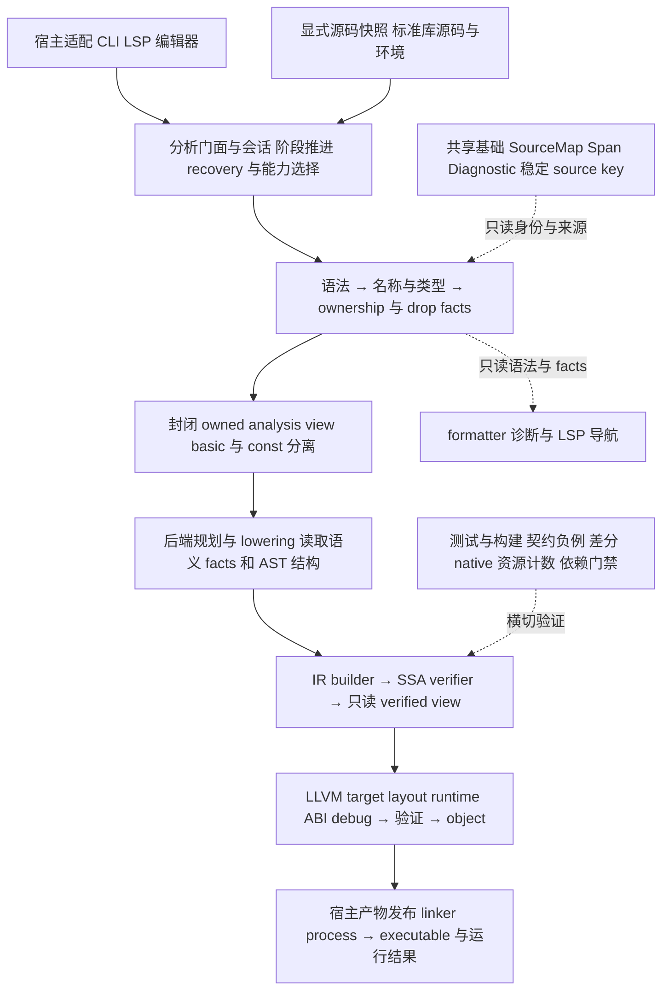

# Koven 整体架构与工程治理实施计划

> **性质**：已批准实施计划 · **状态**：approved / 分阶段执行 · **读取时机**：确定架构治理批次的范围与验收时 · **唯一真源**：本计划；实际进度见[执行账本](engineering-governance-progress.md)

基准：main `34189046319a8b727285d471596647d5de56996e`　日期：2026年10月2日 UTC

批准记录：2026-10-02 用户批准按本计划分步实施。本正文保留批准时的基线、目标、取舍和验收；其中“本轮”指批准前调研。之后的实际交付只更新执行账本与相应 Spec，不把目标设计写成当前实现。

## 1 结论与决策

建议采用“整体逻辑分层设计＋小步迁移”。范围是整个编译器与工具链：CLI/LSP、分析会话、源码与诊断、语法、名称与类型、ownership/drop、后端交接、SSA/verifier、LLVM/runtime、标准库、产物链接及测试交付。lexer→parser 只是一个已有良好边界的例子。

- 文档：17 份 active Spec 中，16 份是补最终证据后可关闭的候选；0182 先补强验收映射。建立 current roadmap 与 tour，保留历史原文
- 测试：保留 Rust 原生的私有单元测试边界；按领域拆大文件，1000 物理行软上限覆盖手写生产、测试和 helper
- 架构：先封闭分析产物的身份与能力交接，再统一宿主编排和事实查询；单文件/unit 内核合并以语义与恢复能力对齐为前提
- 交付：纯搬迁、行为修复、文档状态变更分别提交。每个阶段有独立验收与回退点，计划获批前不实施

### 已核验基线

| 事项 | 事实 | 如何使用 |
|---|---|---|
| PR14 | 已合并到上述 main；[主干 CI 36979753900](https://github.com/Halckon/koven/actions/runs/36979753900) 8/8 jobs success | 满足先完成 PR14 再调研的前置条件 |
| Spec 生命周期 | 17 active，217 archive；0247 的归档收尾未进入该次 merge | 实现合并与文档归档分开核验 |
| Rust 尺寸 | 591 文件，269724 PLOC，50 个超千行；生产部分本身超限的有 26 个 | 是职责整理基线，不是一次性重写清单 |
| 测试隔离 | 114 个完整 src 测试模块静态追踪均只经 cfg(test) 可达 | 未发现普通 release 的测试模块泄漏；未做二进制体积测量 |
| CI 选择 | frontend 121 个 integration targets；stage/Guide 去重选择 65 个 | 56 个未由这两段脚本选中；绿灯不等于 frontend 全量通过 |
| 现有架构 | 五 crate、四条 workspace 依赖边、无环；LLVM 留在 codegen | 优先修合同与职责，不先改物理包结构 |

本轮实际运行文档结构检查（456 Markdown 通过）与 policy tests（45 通过）；Rust/native 执行事实引用已核验 CI。本轮未重新运行 Cargo、性能基准或教程示例。

### 方案比较

| 方案 | 收益 | 成本与风险 | 建议 |
|---|---|---|---|
| 只清目录与拆文件 | 快速改善阅读和状态 | 无法解决交接身份、双轨与编排漂移 | 作为前置治理 |
| 逻辑分层与渐进收紧合同 | 直接降低错误组合和规则重复 | 需要契约与差分测试，收益可逐步验证 | 采用 |
| 全面拆 crate 与统一 trait | 物理边界更硬 | 大量 API/ID 迁移；没有已测收益支撑 | 暂不采用 |

初期保留现有五 crate。逻辑层不要求一层一个 crate；以后只有独立复用、依赖隔离或构建成本的实证收益足够，才通过新 ADR 考虑提取 driver/source 等 crate。

## 2 整体架构从现状到目标

### 现状与核心问题

现有物理依赖是 CLI→codegen→frontend，CLI→frontend，LSP→frontend；lang-std 通过 Koven 源码输入参与编译。单文件与 unit 的 names、types、ownership、lowering 入口并存。names 已复用 local resolver，但类型、所有权及 lowering 仍有独立实现，尚未完全实现 ADR0020 的单文件包装 unit 目标。[现状与职责](https://github.com/Halckon/koven/blob/34189046319a8b727285d471596647d5de56996e/docs/architecture/pipeline-and-workspace.md#L5-L40)

最优先的问题是分析生命周期和交接合同分散。unit native API 的八个参数中，六项 frontend 输入必须同源、同环境、同轮分析；backend 通过反复重建 index 防混链。普通 native→lower 成功路径静态可见四次 index 重建，这不是耗时测量，不能据此承诺性能提升。[native.rs 200–229](https://github.com/Halckon/koven/blob/34189046319a8b727285d471596647d5de56996e/crates/lang-codegen/src/native.rs#L200-L229)

### 目标逻辑结构

以下名称表达职责，不承诺新增 crate、公共 API 或框架。实线是主数据流，旁路消费者不参与核心语义决策。



### 需要保留的正确设计

Lexer 的 LexedFile 字段封闭，Parser 有函数门面和私有 engine；unit typed/owned capability 已区分普通与 const；LLVM 不读取语言 AST；LSP 有 prepare/commit、版本拒绝及 last-good snapshot。这些边界应保留并推广，而不是为了“有接口”全面换成 trait。

后端读取 AST 的结构、求值次序和 Span 是合理依赖。应禁止的是重新作名称选择、类型推断和所有权判定。当前 runtime 是 LLVM 按 SSA 需求生成的 ABI/drop glue；formatter 复用生产 lexer/parser。没有证据要求立即新增 runtime crate、optimizer 或 pass manager。

## 3 职责边界与层间合同

### 允许依赖矩阵

| 逻辑层 | 输入与产物 | 禁止或需单独评审 |
|---|---|---|
| 宿主协议与 IO | 参数、manifest、URI、buffers、版本、文件与进程；输出用户协议 | 复制语义算法，修改已发布 facts |
| 分析门面与会话 | 显式源码与环境；recovery snapshot、只读阶段 view | IO、LLVM/LSP 类型、万能可变 context |
| Source 与诊断基础 | immutable text、SourceId、Span、Diagnostic、稳定 source key | 依赖 parser/checker/host 或隐式读盘 |
| 语法 | tokens/trivia、AST、诊断与来源 | 依赖名称、类型、所有权决策 |
| 名称与类型 | resolved identity、canonical types、call/projection/constant facts | 依赖 ownership、SSA、LLVM |
| Ownership 与 drop | typed/resolved facts、控制结构；loan/move/capture/drop plans | 重做 overload/name/type 选择，依赖 LLVM layout |
| 后端交接与规划 | 封闭 owned view、entry、AST 结构；instance plan 与 IR builder 输入 | 重跑 frontend 决策；旧 index 重建仅作临时迁移例外 |
| IR 核心与 verifier | IR-local types、Origin/Span；已验证的只读 IR | AST payload、NameResolution、TypeEnvironment、LLVM |
| LLVM 与 runtime ABI | verified IR、target/layout、debug source view；object | 名称、类型与 ownership 决策 |
| 标准库与交付支撑 | Koven 源码、compiler-bound bindings、测试与 CI | frontend 隐式加载标准库；编辑器 parser 取代生产 parser |

### 数据所有权与生命周期

一个 snapshot 共同拥有 SourceMap、ParsedFile 集合、环境及阶段结果。临时 SourceUnitInput 在调用时生成；只读能力 view 借用 snapshot，避免构造自引用 Rust 结构。LSP 更新建立新 generation 并原子替换，旧 facts 不能与新 source 混用；稳定输出不依赖 generation、地址或加载顺序。

各 pass 仍接收最小输入，不把 snapshot 的全部可变状态交给每层。builder 与结果分开，封闭工厂绑定 provenance；把八个参数装入公共字段 struct 不算完成边界治理。基础/const 能力继续不同，recovery、typed complete、owned complete、backend supported 不能压成一个 bool。

### 错误与配置

语言错误保留 Diagnostic code、severity、Span 和顺序；身份或模型失配保留内部错误；文件、linker、进程错误留宿主层；语言合法但 backend 未支持是独立能力边界。analysis environment、entry、target/emission options、用户输出策略分别显式传入，不传播整份 CLI 参数或全局 Compiler singleton。

### 接口与扩展点

优先函数门面、具体类型、私有模块和只读 view。小 trait 只服务已有两个 adapter 的纯算法，或有真实替换/测试需求的 SourceProvider、诊断呈现、linker/target 服务。现在不新增 VFS 框架或通用 SemanticContext trait。VerifiedProgram 可在后续表达修改后必须重验，但首片保留 SSA/LLVM 双重验证；未来优化和第二 backend 需要独立需求与决策。[Rust 可见性依据](https://doc.rust-lang.org/reference/visibility-and-privacy.html)

## 4 文档与 Spec 生命周期

### 当前文档的唯一职责

| 位置 | 唯一职责 | 本次建议 |
|---|---|---|
| docs/guide/ | 现行 v0.41 语言语义与强制 Phase | 保持规范权威，不从代码反推新规则 |
| docs/compiler-specs/ | 内部表示、算法、资源与层间合同 | 分阶段加入获批工程合同，current 不表示已实现 |
| docs/architecture/ | 已实现事实与支持矩阵 | 随实现更新；目标设计不冒充现状 |
| docs/specs/ 与 docs/adr/ | 有界交付验收与长期决策 | 关闭完成 Spec；accepted ADR 继续保留 |
| docs/specs/evolution-status.md | 原 13 项演进状态真源 | 修正待发布、Draft、CI 等过时摘要 |
| docs/development/roadmap.md | 新 current 导航与下一批次入口 | 引用状态真源，不复制第二张状态表 |
| docs/tutorials/ | 新 current 教程和受测示例 | 新建 README.md 与 koven-tour.md，可按预算拆章 |
| docs/archive/ | 冻结规范、旧教程与验收历史 | 保存原文，只作允许的机械链接更新 |

旧 06-roadmap 位于 v0.34 archive；唯一 tour 是 v0.28 历史教程，含旧 borrow 调用、数字字面量和功能状态。应新建当前入口，不能继续滚动改写历史。旧 roadmap 最近也曾被更新，这属于历史状态混用，不能悄悄改成“从未发生”。[治理规则](https://github.com/Halckon/koven/blob/34189046319a8b727285d471596647d5de56996e/docs/AGENTS.md#L41-L70)

### 关闭候选与 0247 收尾

逐项复核 0228–0242 与 0247，追加最终实现 SHA、PR、精确 CI、验收映射和非目标，保留当时红/绿及未运行记录原义。0235 最终应为 done，不能因早期候选被取代而把整个合同标成 superseded。

0247 的实现已合并，归档提交 3c06e37a 未进入 main。要复用其最终 CI 账本正文，再按最新 main 更新路径、索引、inventory、DAG 与全仓链接，不能整份覆盖旧索引。10 个受影响目标列于附录。若 16 项复核全部成立，才验收为 active 1、archive 233；这不等于原 13 项语言演进全部完成。

### 0182 先补证据再判定完成

7 个 SSA 与 8 个 native 专项测试已在主干 Ubuntu CI 逐名通过，支持多元素、break/continue、临时 source、解构、嵌套、early return 与 Unicode 借用等形态。合同中的 empty/single、source 只求值一次、逐 CFG 清理顺序、ZST 与精确 drop/资源次数、malformed/mixed products、确定性，仍缺精确逐项映射。

先查可复用证据，缺口补定向断言。只有发现真实生产问题才写最小修复；当前结论是验收强度不足，未证明生产 bug。不得删断言、降低 Goal 或凭测试数量关闭。[0182 合同 50–62](https://github.com/Halckon/koven/blob/34189046319a8b727285d471596647d5de56996e/docs/specs/active/0182-sequential-for-lowering.md#L50-L62)

## 5 测试组织与千行软上限

### 优先热点

PLOC 按 UTF-8 文本 splitlines 计数，包含空行、注释和多行字符串。生产/测试区间拆分是静态近似；不把逻辑行、测试函数数或二进制体积混为一谈。以下路径相对相应 crate。

| Crate 与文件 | PLOC | 处理重点 |
|---|---:|---|
| frontend src/ownership_checking/checker/drop_planner/iteration.rs | 14688 | 约 12816 测试行，先外置再按领域拆；约 1872 生产行另批拆 |
| frontend tests/ownership_iteration.rs | 12063 | 保留 target，按 phi、source loans、capture、control exits 分组 |
| frontend tests/multifile_type_checking.rs | 7202 | 保留 104＋3 共 107 个测试身份及 source-qualified 断言 |
| frontend tests/multifile_ownership_checking.rs | 4692 | 按 calls、construction、closures、drop plans 分组 |
| codegen src/ssa/unit_lower_receiver_tests.rs | 3383 | 保留 cfg(test)，按 interface/delegation/inout/value delivery 拆 |
| codegen src/ssa/unit_plan.rs | 3061 | 纯生产热点，按 provenance、instance graph、type demand 划界 |
| LSP src/server.rs | 1747 | 约 1250 测试行；低风险迁移示范，生产约 497 行 |

### 组织规则

私有状态与防御性测试留在 src 所属模块，用 cfg(test) 加载 src/owner/tests.rs 或 tests/domain.rs。公共 API、跨文件或 CLI 行为留 integration。Rust 官方支持这两种边界；移动目录不是提升生产 pub API 的理由。[Rust 测试组织](https://doc.rust-lang.org/book/ch11-03-test-organization.html)

保留现有 tests/ownership_iteration.rs 入口和 --test 名称，正文放 tests/ownership_iteration/ 子模块。共享 helper 放现有 support/ 或 common/mod.rs，避免意外新增 test binary。不要一次合并全部 121 个 frontend targets；只有同领域试点的 compile/link/RSS 实测收益明确，才进一步整合。[Cargo Targets](https://doc.rust-lang.org/cargo/reference/cargo-targets.html#integration-tests)

### 软上限政策

1000 PLOC 适用于手写生产、测试与 helper，是项目评审阈值，不是 Rust 官方规定。生成产物单列输入与生成器版本，不机械拆分。继承当前 50 个超限文件为 baseline；旧欠账先报告，新增超限或超限增长要求显式例外，含负责人、理由、当前尺寸、拆分方向和复查条件。门禁只阻止未登记增长或绕过，不让历史欠账一次全仓硬失败。

禁止压行、删空行、缩断言或 include 碎片拼接来凑 999。单个大型语义场景可保留有理由的例外；把 12816 行测试整体搬到一个 tests.rs 只算第一步。

### 搬迁的语义保全

保存 package/target/full_test_name/platform cfg/ignore 原因；名称变化建立一对一映射。move-aware diff 核对测试体、输入、assertions、诊断码/Span、native oracle、macro/attributes 和 fixture hash。保留 case ID、负例、红测来源、matrix 预算、压力/递归保护及生成程序资源计数。数量相同只是辅助，不能替代语义差分；旧过滤器必须非零命中。

## 6 前三阶段与具体交付

阶段按依赖推进，S/M/L 为相对工作量，不是工期承诺。每阶段可由多个小 PR 完成；纯移动 commit 不混入语义修复。正式开始时刷新 main 与本基准的差异。

### P0 冻结范围与验收基线 S

前置：本计划获批。范围：记录源码 SHA、工具链、target 清单、受影响测试身份、facts/诊断/SSA/native 预期、架构允许边和性能样本；确认 basic/const、单文件/unit、CLI/LSP 的能力矩阵。路径：根 AGENTS.md、docs/development/testing.md、docs/architecture/pipeline-and-workspace.md、Cargo manifests。

交付：可复核的 baseline、每批影响清单与拟议 Spec/ADR。禁止为建基线改变算法、支持范围或既有 skip。先核实 Rust 1.96.0、LLVM 21.1.x 与对应 Clang；Cargo 命令串行执行。

验收：每项事实能定位固定源码或实际日志，未知项显式记录；测试名和 filter 可匹配。风险是刷新后的 main 漂移，回退是重建基线，不覆盖新改动。

### P1 文档闭环与 0182 证据 M

前置：P0。范围：第4节的 16 个归档候选、current 索引、0247 收尾与 0182 验收表。路径：docs/specs/active、archive/specs、evolution-status.md、相关 README、DAG、scripts/check_docs.py；新增 roadmap 导航。0182 的代码/测试补强与归档文档分开批次。

交付：每份最终验收账本、同步迁移与无旧路径引用；0182 明确已证明、待证明和原非目标。若需要生产修复，先红测再最小实现，仍在原合同范围；新语义先停下决策。

验收：文档与 policy tests 通过；16 项条件成立才达到 1 active/233 archive。0182 必须有精确 oracle 才关闭，不能让文档门禁代替行为证据。回退按文档迁移或单个行为 PR 回退，保全原历史。

### P2 测试结构与行数护栏 M 至 L

前置：P0；可在 P1 独立文档工作之外分支进行。顺序：LSP server 测试示范→codegen unit receiver/plan 测试→iteration 测试外置及领域拆分→大 integration 内部分组→生产职责拆分。不先改 target 集合、不顺便去重测试、不新增统一测试框架。

交付：1000 PLOC 政策、baseline/growth guard、每批身份映射和语义 diff、定向运行证据。iteration 的生产拆分须独立覆盖图算法、phi seeding 与 incoming/forwarding，不能随测试搬迁夹带。

验收：测试输入/断言/负例/fixture 来源和 native 计数不变；target 不增不漏；受影响的非默认 CI 套件也实际运行。先测冷/热 compile/link、执行时间与 RSS，再定可接受噪声及退化预算，不能虚构提速百分比。风险是 module path、helper 可见性、扫描目录和 include 路径改变；按单批纯移动回退。

### 直接验证示例

```sh
python3 scripts/check_docs.py
python3 -m unittest discover -s scripts/tests -v
git diff --check
cargo test --locked -p lang-lsp
cargo test --locked -p lang-codegen --lib unit_lower_receiver_tests
cargo test --locked -p lang-frontend --lib ownership_checking::checker::drop_planner::iteration
cargo test --locked -p lang-frontend --test ownership_iteration
```

以上是实施命令示例，不表示本轮重新执行。已知 filter 直接运行并核命中；名称变动时才先用同一选择追加 -- --list。

## 7 架构迁移与教程门禁

### P3 封闭交接与共享编排 L 分两片

前置：P0 的能力/身份基线，P2 已验证的测试迁移方式。P3a 先仅处理普通 unit：frontend 受控工厂构造匹配的 owned-unit 借用 view；codegen 接收 view，旧公开入口保留校验转接，内部不重复 index。目标路径：type_checking/compilation_unit、ownership_checking/compilation_unit、codegen native.rs、ssa/unit_plan.rs、ssa/unit_lower.rs；新 view 的具体归属在 Spec 封闭。

验收：foreign SourceMap、names/environment/typed/owned 混轮仍失败；合法 clone 身份保持；basic/const 互换 compile-fail；身份/能力校验失败在创建或写入输出前被拒绝；后续 emission/link 失败保持既有最终产物不变并清理临时文件；facts、诊断、SSA、stdout/exit、drop/alloc/free 等价。记录 index 构建次数证明重复消失，不能直接删校验。const 另片接同模式，不先抹平能力。

P3b 再提取无 IO 的 frontend analysis/session 门面，迁 CLI project_build/bootstrap，后迁 LSP analysis/unit_session。宿主保留文件、overlay、版本、呈现与进程，门面只做阶段推进与 snapshot。保持 CLI fail-fast 与 LSP recovery/last-good；先固定现有 const 阶段差异，改变支持范围另立行为验收。

交付：合同、兼容转接、直接消费者迁移与性能对照。风险为借用生命周期、身份证明失效、误升级 recovery；每片保留可回退旧入口，不建立长期平行新框架。若需新增 crate 或改变长期决定，先新 ADR。

### P4 共享纯内核与双轨收敛 L 条件阶段

前置：P3 交接与编排稳定，单文件/unit parity 矩阵可审阅。先从已证实相同的事实查询或纯算法选一个责任，例如 source locator、constant evaluator、argument mapping/canonical type；让消费者读取窄 view，减少重复索引。共享 lowering error/helper 移到中立内部模块，IR core 与 frontend adapter 的逻辑边界明确。

交付：一个垂直切片、一组配对 fixture、规范化 ID/Span/facts 差分与依赖门禁。不直接比较两个入口的裸 TypeId；覆盖错误恢复、同名 symbol、泛型、const、receiver、drop 和 source-order 置换。AST 结构访问可保留，语义决策只有一处。

单文件包装 unit 是方向，不是本阶段无条件全量替换。只有能力、诊断和恢复兼容映射成立，才逐域收敛 checker/lowering；未对齐功能不能消失。若收益不足，保留双 driver 并共享确定相同的内核也可接受。风险是微妙语义漂移，回退单位为单一领域；发现新行为需求停止并单独评审。

### P5 Current 教程与持续防漂移 M

前置：P1 current 路由；可先于 P4 完成。新 tour 从当前 README 的 build/hello 开始，按已证明能力逐步覆盖数字、自动借用、String.clone、顺序 for、跨文件、root replace/swap、concrete deinit。每个 example ID 标 run/check/compile-fail/planned；源码直接提取或引用受测 fixture，不能手工复制两份。

交付：docs/tutorials/README.md、koven-tour.md、示例清单/提取门禁，以及 CI 路径与 selection 自测。修复 editors/** 未触发相关契约测试的缺口，明确 std 资产测试归属；stage/Guide 保留独立运行能力，只在组合执行时按身份去重。

验收：run 示例在两宿主真实 link/run；负例核精确诊断；零命中、重复/丢失 ID、源码漂移、非法依赖和 required job 异常 skip 必须失败。冻结文档内容受保护，当前摘要从有限单源派生；外部 PR/CI 状态在交付时按 exact SHA 核验。回退可独立撤销提取器/路径策略，不修改 Guide 或降低既有压力覆盖。

顺序：P0→P1；P0→P2→P3a→P3b→P4。P5 依赖 P1 与稳定示例，可并行准备；正式 Cargo 验证不争用同一 target。

## 8 验收回退与批准范围

### 分层验收矩阵

| 变化类型 | 必需证据 | 明确不能替代 |
|---|---|---|
| 状态、链接、归档 | docs check、policy tests、迁移账本、diff | 不用无关 Rust 全量证明文档正确 |
| 纯测试搬迁 | 身份映射、语义 diff、fixture/hash、实际命中、cfg/target 检查 | 不只对比测试数量或 CI 汇总 |
| 阶段产物与公开 API | 直接消费者、workspace check、compile-fail、provenance 负例 | 不以公共可构造 struct 代替 capability |
| 编排与宿主 | CLI human/JSON/exit；LSP version/last-good/UTF16/URI 排序 | 不把 CLI 与 LSP 的阶段差异默默抹平 |
| SSA、LLVM、runtime | verifier、目标布局、object/link/run、资源次数及顺序 | 不只编译；LLVM verifier 不证明语言所有权 |
| 性能与边界 | 同输入/工具链样本、噪声区间、index/clone/RSS；原压力预算 | 不把静态调用次数写成提速结果 |

### 架构门禁分三层

1. Cargo metadata 检查 member 与 crate 依赖 allowlist。逻辑模块门禁另管逆向边，尊重 test/cfg，添加“故意引入 forbidden import 会失败”的自测；词法脚本明确局限，不能冒充 rustc 全解析
2. 类型与运行时合同检查私有构造、basic/const 隔离、跨 snapshot 混源、错误环境、recovery 拒绝与输出原子性；后续 VerifiedProgram 若启用，变更必须使证明失效并重验
3. 行为测试保护稳定诊断、facts、source-order 确定性、native 与资源行为；依赖图不能替代语义差分

### Rust 与跨阶段收尾命令

```sh
cargo fmt --all -- --check
cargo check --locked --workspace --all-targets
cargo clippy --locked --workspace --all-targets -- -D warnings
cargo test --locked -p lang-frontend --doc
cargo test --locked -p lang-codegen --doc
cargo test --locked -p lang-frontend --no-fail-fast --test multifile_type_checking --test multifile_ownership_checking --test multifile_constant_facts --test multifile_two_phase_borrows
cargo test --locked -p lang-codegen
cargo test --locked -p lang-cli
cargo test --locked -p lang-lsp
bash scripts/check_stage_integration.sh
bash scripts/check_guide_litmus.sh
```

按影响面选用，不要求每个小 PR 全部重跑。默认不跑 frontend 全量或 workspace 全量 tests；共享 helper 改动必须覆盖直接消费者与相关 matrix/stress。无法界定影响就记录缺口并扩大评审，不能宣布完成。filtered、ignored、not-run、timeout 与 passed 分开记账；macOS 既有 LLDB ignore 不扩大也不冒充通过。

### 交付与回退纪律

获批后从最新 main 建特定 Spec 分支，先本地验证，再 Draft PR 与所需 macOS/Ubuntu CI。纯文档遵循现有合法路径过滤，不把 feature push 绿灯当 PR 全矩阵。每批保留可审阅小提交，合并由用户决定。回退只针对本批差异，保留其他用户修改；不以 cargo clean、放宽断言或扩大 ignore 作为修复。

### 已批准的决定（2026-10-02）

- 采用整体逻辑分层与上述迁移顺序，先封闭交接，后共享编排，再按证据决定双轨收敛
- 将千行软上限扩展到手写测试/helper，并用历史 baseline 与新增长审查实施
- 按有界合同复核 16 个归档候选，0182 补证据；新建 current roadmap/tour，保留历史


## 附录 A 全部 17 份 Active Spec 处置

“候选关闭”指原有界 Goal 可进入最终关闭评审，不表示该功能所有变体已支持。表内链接均固定基准提交；CI 组见附录 C。

| Spec | 建议 | 验收事实与必须保留的范围 |
|---|---|---|
| [0182 顺序 for](https://github.com/Halckon/koven/blob/34189046319a8b727285d471596647d5de56996e/docs/specs/active/0182-sequential-for-lowering.md#L50-L62) | 保留 active | 7 SSA＋8 native 通过；补 once/ZST/精确 drop/清理/畸形产物/确定性证据 |
| [0228 Linux native](https://github.com/Halckon/koven/blob/34189046319a8b727285d471596647d5de56996e/docs/specs/active/0228-linux-x86-64-native-host.md#L274-L324) | 候选 done | PR5 与后继证据；不扩交叉编译、musl、Linux AArch64 或 LLDB 声明 |
| [0229 数值字面量](https://github.com/Halckon/koven/blob/34189046319a8b727285d471596647d5de56996e/docs/specs/active/0229-extended-numeric-literal-values.md#L18-L84) | 候选 done | PR7；radix/underscore 与整数 native，浮点 native 不在原 Goal |
| [0230 递归 Box enum](https://github.com/Halckon/koven/blob/34189046319a8b727285d471596647d5de56996e/docs/specs/active/0230-recursive-boxed-enum-native.md#L18-L71) | 候选 done | PR7；两入口及 45 次分配释放；不扩 generic/Rc/nullable/unbox |
| [0231 TypeRef trial](https://github.com/Halckon/koven/blob/34189046319a8b727285d471596647d5de56996e/docs/specs/active/0231-contextual-type-ref-trials.md#L17-L77) | 候选 done | PR7；Parser、strict trial 与回滚；旧 borrow 待决说明补后继引用 |
| [0232 primitive facts](https://github.com/Halckon/koven/blob/34189046319a8b727285d471596647d5de56996e/docs/specs/active/0232-ownership-primitive-type-facts.md#L17-L84) | 候选 done | PR7；typed identity/事务/validation；完整 native、复杂 place 不在本 Goal |
| [0233 Compiler Contracts](https://github.com/Halckon/koven/blob/34189046319a8b727285d471596647d5de56996e/docs/specs/active/0233-parser-compiler-contracts.md#L18-L74) | 候选 done | PR7；九段 4667 字节迁移保全；不要求搬完全部工程文字 |
| [0234 block 换行](https://github.com/Halckon/koven/blob/34189046319a8b727285d471596647d5de56996e/docs/specs/active/0234-block-newline-continuation.md#L17-L87) | 候选 done | PR7；完整左式与未完成表达式续行；其余 grammar 缺口另排 |
| [0235 v0.40 启用](https://github.com/Halckon/koven/blob/34189046319a8b727285d471596647d5de56996e/docs/specs/active/0235-approved-language-rules.md#L20-L82) | 候选 done | PR7；完成真实启用 Goal，不标整份 superseded；保全真实 v0.39 与撤回历史 |
| [0236 String.clone](https://github.com/Halckon/koven/blob/34189046319a8b727285d471596647d5de56996e/docs/specs/active/0236-explicit-string-clone.md#L19-L66) | 候选 done | PR7；两入口、UTF8/NUL/empty、失败与释放；不扩通用 clone |
| [0237 阶段整合](https://github.com/Halckon/koven/blob/34189046319a8b727285d471596647d5de56996e/docs/specs/active/0237-local-integration.md#L19-L93) | 候选 done | PR7 最终 head；交叉 typed/native，补后继 CI 核查；不是全量 frontend |
| [0238 Guide Litmus](https://github.com/Halckon/koven/blob/34189046319a8b727285d471596647d5de56996e/docs/specs/active/0238-guide-litmus-gate.md#L20-L82) | 候选 done | PR7；原 Goal 为勘误与精确暴露缺口，不等于实现全部 Litmus |
| [0239 双宿主 CI](https://github.com/Halckon/koven/blob/34189046319a8b727285d471596647d5de56996e/docs/specs/active/0239-linux-ci-gates.md#L20-L76) | 候选 done | PR7 双宿主真实执行；保留合法 docs-only skip 与 LLDB ignore |
| [0240 位运算与 inv](https://github.com/Halckon/koven/blob/34189046319a8b727285d471596647d5de56996e/docs/specs/active/0240-integer-bitwise-execution.md#L13-L77) | 候选 done | PR8 与最终 PR9；位宽/shift/求值顺序/Litmus12；不扩 const 白名单 |
| [0241 return control](https://github.com/Halckon/koven/blob/34189046319a8b727285d471596647d5de56996e/docs/specs/active/0241-return-control-operands.md#L20-L43) | 候选 done | PR9；前端两入口与单入口 native；unit enum 条件/direct case 仍非目标 |
| [0242 调用自动借用](https://github.com/Halckon/koven/blob/34189046319a8b727285d471596647d5de56996e/docs/specs/active/0242-automatic-borrow-call-migration.md#L17-L79) | 候选 done | PR9；移除调用 borrow 与 fixtures；完整 tree-sitter 五项旧失败另项处理 |
| [0247 multifile 基线](https://github.com/Halckon/koven/blob/34189046319a8b727285d471596647d5de56996e/docs/specs/active/0247-multifile-baseline.md#L18-L64) | 候选 done | PR14/main；107 项与 fail-closed 已证实；归档正文尚需恢复到主干 |

0179、0211、0212 及 0243–0246 已归档，不重新打开。accepted ADR 的生命周期与完成 Spec 不同，不随本批归档。

## 附录 B 关键源码与遗漏文档

### 架构证据索引

以下源码链接固定在 34189046319a8b727285d471596647d5de56996e，可直接定位行范围。

- [ADR0020 现行 compilation-unit 决定](https://github.com/Halckon/koven/blob/34189046319a8b727285d471596647d5de56996e/docs/adr/accepted/0020-multifile-compilation-unit.md#L27-L70)：身份、recovery/validated、单文件包装 unit、单 object
- [lexer/mod.rs 25–58](https://github.com/Halckon/koven/blob/34189046319a8b727285d471596647d5de56996e/crates/lang-frontend/src/lexer/mod.rs#L25-L58) 与 [parser/mod.rs 18–95](https://github.com/Halckon/koven/blob/34189046319a8b727285d471596647d5de56996e/crates/lang-frontend/src/parser/mod.rs#L18-L95)：已有封闭产物与函数门面
- [type_checking/compilation_unit/bodies.rs 947–1000](https://github.com/Halckon/koven/blob/34189046319a8b727285d471596647d5de56996e/crates/lang-frontend/src/type_checking/compilation_unit/bodies.rs#L947-L1000) 与 [ownership_checking/compilation_unit.rs 1064–1098](https://github.com/Halckon/koven/blob/34189046319a8b727285d471596647d5de56996e/crates/lang-frontend/src/ownership_checking/compilation_unit.rs#L1064-L1098)：能力构造与 validation
- [ssa/unit_plan.rs 569–590](https://github.com/Halckon/koven/blob/34189046319a8b727285d471596647d5de56996e/crates/lang-codegen/src/ssa/unit_plan.rs#L569-L590)、[type model.rs 1297–1318](https://github.com/Halckon/koven/blob/34189046319a8b727285d471596647d5de56996e/crates/lang-frontend/src/type_checking/compilation_unit/model.rs#L1297-L1318)、[ssa/unit_lower.rs 132–154](https://github.com/Halckon/koven/blob/34189046319a8b727285d471596647d5de56996e/crates/lang-codegen/src/ssa/unit_lower.rs#L132-L154)：重复 index 交接路径
- [CLI project_build.rs 170–214](https://github.com/Halckon/koven/blob/34189046319a8b727285d471596647d5de56996e/crates/lang-cli/src/project_build.rs#L170-L214) 与 [LSP unit_session.rs 233–244](https://github.com/Halckon/koven/blob/34189046319a8b727285d471596647d5de56996e/crates/lang-lsp/src/unit_session.rs#L233-L244)：const 能力分支差异；只证明阶段路径不同，未证明用户诊断故障
- [LLVM module_lowering.rs 72–117](https://github.com/Halckon/koven/blob/34189046319a8b727285d471596647d5de56996e/crates/lang-codegen/src/llvm/adapter/module_lowering.rs#L72-L117)：SSA 与 LLVM 验证边界
- [iteration.rs 1872–1876](https://github.com/Halckon/koven/blob/34189046319a8b727285d471596647d5de56996e/crates/lang-frontend/src/ownership_checking/checker/drop_planner/iteration.rs#L1872-L1876) 与 [LSP server.rs 498–510](https://github.com/Halckon/koven/blob/34189046319a8b727285d471596647d5de56996e/crates/lang-lsp/src/server.rs#L498-L510)：测试条件入口
- [CI workflow 37–80](https://github.com/Halckon/koven/blob/34189046319a8b727285d471596647d5de56996e/.github/workflows/ci.yml#L37-L80)、[stage 10–42](https://github.com/Halckon/koven/blob/34189046319a8b727285d471596647d5de56996e/scripts/check_stage_integration.sh#L10-L42)、[Guide 7–29](https://github.com/Halckon/koven/blob/34189046319a8b727285d471596647d5de56996e/scripts/check_guide_litmus.sh#L7-L29)：路径过滤与有界覆盖

### 0247 的 10 个归档目标

归档分支 [3c06e37a](https://github.com/Halckon/koven/commit/3c06e37a) 相对已合并实现仅有以下文档/inventory 变化，没有 Rust 源码变化。恢复自身最终账本后，索引与 DAG 依最新 main 重算。

1. docs/specs/active/0247-multifile-baseline.md → docs/archive/specs/0247-multifile-baseline.md
2. docs/archive/specs/README.md
3. docs/archive/specs/dependency-graph-full.md
4. docs/archive/specs/dependency-graph-full.svg
5. docs/specs/README.md
6. docs/specs/active/README.md
7. docs/specs/dependency-graph.md
8. docs/specs/dependency-graph.svg
9. docs/specs/evolution-status.md
10. scripts/check_docs.py

## 附录 C 交付证据与官方依据

### 精确 CI 链

| 合同组 | 最终 PR head | 合并节点 | 核验结果 |
|---|---|---|---|
| 0228 | 53bc552173db3ba2883e6493f11cd94a17a8d91b | PR5 → d3e64a4 | [36846162707](https://github.com/Halckon/koven/actions/runs/36846162707) 6/6；当时 macOS CI，Linux 为原本地证据 |
| 0229–0239 | 11051e200441a21cdf6dee6a6d153d2e9ffe26c6 | PR7 → e22e11b | [36877486546](https://github.com/Halckon/koven/actions/runs/36877486546) 8/8，双宿主真实执行 |
| 0240 | 57a181695f4408378140fae1cea40caaa396bfae | PR8 → 8f3e460 | [36884583273](https://github.com/Halckon/koven/actions/runs/36884583273) 8/8 |
| 0241/0242 | 99e63d51854dbade0304dd8c86339183031dae06 | PR9 → 2ad6967 | [36952398650](https://github.com/Halckon/koven/actions/runs/36952398650) 8/8，最终整合 head |
| 0247 | d333e41441dcb2b9b34f58b3ae5251fe75d046a0 | PR14 → 3418904 | [36978695764](https://github.com/Halckon/koven/actions/runs/36978695764) 8/8；main [36979753900](https://github.com/Halckon/koven/actions/runs/36979753900) 8/8 |

[主干 Ubuntu 实际日志](https://github.com/Halckon/koven/actions/runs/36979753900/job/110752088649) 用于逐名核验相关 suite/native。归档候选的原始失败与后继修复分别记录，不倒填历史“未运行”。CI 只证明其实际选定范围。

### 官方 Rust 与 Cargo 资料

- [Rust Book Test Organization](https://doc.rust-lang.org/book/ch11-03-test-organization.html)：私有单元测试与公共 integration 的边界；cfg(test) 与 common/mod.rs
- [Cargo Targets](https://doc.rust-lang.org/cargo/reference/cargo-targets.html)：每个 integration target 是独立 executable，多模块组织可以避免盲目增加 binaries
- [Rust Reference Conditional Compilation](https://doc.rust-lang.org/reference/conditional-compilation.html#test)：test 配置与优化级别不同；cargo test --release 仍编译测试
- [Rust Reference Visibility and Privacy](https://doc.rust-lang.org/reference/visibility-and-privacy.html)：私有模块、受限可见性与 re-export 可构成真实接口边界
- [Cargo Test](https://doc.rust-lang.org/cargo/commands/cargo-test.html)：target、filter 与测试执行方式

这些资料支持 Rust 原生组织原则，不规定千行上限，也不替 Koven 决定语言语义。整体分层、封闭交接和软上限是结合本仓库证据提出的设计建议，不声称唯一最佳架构。

### 历史与当前入口

[Guide v0.40](https://github.com/Halckon/koven/blob/34189046319a8b727285d471596647d5de56996e/docs/guide/README.md) 是现行规范；[演进状态](https://github.com/Halckon/koven/blob/34189046319a8b727285d471596647d5de56996e/docs/specs/evolution-status.md#L13-L45) 是当前进度入口。[旧 roadmap](https://github.com/Halckon/koven/blob/34189046319a8b727285d471596647d5de56996e/docs/archive/guides/v0.34-pre-restructure/06-roadmap.md) 与 [v0.28 tour](https://github.com/Halckon/koven/blob/34189046319a8b727285d471596647d5de56996e/docs/archive/tutorials/koven-language-tour-v0.28.md) 只作历史依据。
