# Koven 语言设计审计（v0.32）

> 文档性质：**非规范审计报告**。本文不修改或启用语言语义，不批准候选 guide、Spec 或 ADR，
> 也不把计划写成 Architecture 事实。现行语义仍以
> [语言设计指南 v0.32](./guide/00-index.md) 为唯一真源。
>
> 审计日期：2026-08-30
> 冻结代码基线：`390660343f4c`；审计时 SPEC-0199 仍为 `in-progress`，工作区还在推进
> SPEC-0215，因此多文件 native 与 lambda drop 的结论只采用已提交/已验收事实，不把在途修改
> 冒充完成状态。

## 1. 审计结论

Koven 的三个根选择彼此兼容，而且已经形成了可验证的实现主线：

1. **Kotlin 风格表面语法**负责可读性与工程熟悉度，但不承诺 Kotlin 源码兼容；
2. **简化单一所有权、Borrow/Inout 与确定性析构**负责资源安全，不复制 Rust 的完整 lifetime、
   NLL、部分移动或 trait 体系；
3. **Rust 编译器、自建 typed SSA、LLVM AOT 后端**负责把语言语义与目标 ABI 隔离。

这条主线应继续保持。当前项目已经不是“只有 parser 的语言草案”：frontend 已覆盖多文件名称、
类型与所有权分析，backend 已覆盖标量、名义聚合、heap owner、`Rc`、顺序容器、闭包、String、
nullable pointer-like owner 与 AArch64 Mach-O/LLDB 主线。另一方面，Koven 目前仍是**单平台、窄
native 子集的编译器工程**，还不能把“原生 AOT”直接等同于“可用于系统编程”。

下一阶段不应同时扩张宏、继承、异步、FFI 与优化器。先封闭以下五个门禁，能显著降低后续返工：

| 优先级 | 门禁 | 为什么先做 |
|---|---|---|
| P0 | 明确 `Any` 是仅泛型上界，还是具有运行时表示的 existential value | 当前 `when` 可把无关分支合并为 `Any`，但容器又禁止 `Any`，backend 也没有对应 ABI；这会污染函数返回、局部值和多文件 native |
| P0 | 拆分 Equality / Hash / Ordering 契约 | String `==` 已完成，而 `Map`、`Hashable` 候选和 `Comparable` 尚未形成一致能力层次 |
| P0 | 完成并统一 compilation-unit native 主线 | 单文件与 compilation-unit 并行分析/ lowering 容易长期漂移；SPEC-0199 是收敛点 |
| P1 | 先建立优化级别、基准与 LLVM 标准 pipeline | 没有基线就讨论自定义内联、逃逸分析或向量化，无法证明收益且容易破坏 drop/loan 语义 |
| P1 | 区分私有平台 runtime ABI 与公共 C FFI | 文件/线程可先消费版本化的 backend-private adapter；源语言 `unsafe extern` 仍需独立 ABI、类型和权限契约 |

对应的 Kotlin/Rust 逐项对照见
[Kotlin 与 Rust 对照清单](./kotlin-rust-design-matrix-v0.32.md)，建议的实施顺序、设计门禁和验收指标见
[v0.32 后续开发路线](./post-v0.32-development-roadmap.md)。

## 2. 审计方法与状态口径

### 2.1 事实来源

本审计按以下边界核对，不把不同文档混成一条可互相覆盖的优先级：

- 语言语义：v0.32 guide 正文；v0.33–v0.37 只作为“候选方向”；
- 实现事实：workspace manifest、Rust 源码、测试、当前 Architecture；
- 实施状态：Spec 的状态、依赖与验收记录；
- 长期选择：已接受 ADR；
- 外部参照：Kotlin、Rust 与 LLVM 官方文档，只用于比较和实现判断，不覆盖 Koven guide。

状态词统一为：

| 状态 | 含义 |
|---|---|
| 已实现 | 现行 guide 已定义，且仓库有实现与测试事实 |
| 部分实现 | frontend、SSA、LLVM、CLI/LSP 中只有一部分形成闭环 |
| 现行未实现 | v0.32 已定义，但对应 native/工具链链路尚未完成 |
| 候选未启用 | 已写入 v0.33–v0.37 或旧候选章节，但不是现行语义 |
| 延后 | guide 明确放到 v2/v3/v4+ 或独立后续设计 |
| 不支持 | v1 明确排除，不能由实现自行补入 |
| 未定义 | 现行 guide 没有足以实施的契约，需要新 guide/ADR/Spec |

### 2.2 可验证基线

审计时仓库具有五个单向依赖的 Cargo member：`lang-frontend`、`lang-codegen`、`lang-cli`、
`lang-lsp`、`lang-std`。frontend 不依赖 LLVM；codegen 使用 Inkwell/LLVM 21；目标机当前固定为
AArch64 macOS，object 为 Mach-O，并由 Clang 链接。

量级只作为复杂度信号，不作为质量评分：Rust 源码约 14.9 万行，测试源码约 4.4 万行，
frontend integration test 文件超过 100 个，Koven fixture/stdlib 源文件约 70 个。Spec 数量已超过
200，说明可追溯性很强，也意味着状态维护与重复实现的治理成本已经不可忽略。

### 2.3 本审计的维护生命周期

本文及两份配套文档是 **2026-08-30 的冻结审计快照**，不是第五套持续状态真源：

- guide、已批准 Spec、已接受 ADR 与 Architecture 与本文冲突时，分别按各自权限边界为准；
- 实时实施顺序仍只维护在 [`docs/specs/README.md`](./specs/README.md)，本文的“波次”只是建议；
- 后续实现不要求同步改写本快照；只有用户明确要求重新审计时才更新基线、结论和日期；
- 当现行 guide 不再是 v0.32 时，README 应把本组链接标为历史审计或由新版审计取代，不原地把
  v0.32 结论伪装成新版本事实。

## 3. 当前语言与编译器的真实形态

### 3.1 语言定位

Koven 不是 Kotlin 方言，也不是 Rust 语法翻版：

- 从 Kotlin 借用基础类型命名、`package`/`import`、`val`/`var`、class-family、lambda、`when`、
  nullable、Elvis、具名实参等表面习惯；
- 从 Rust 借用“值只有一个 owner、转交发生 move、借用不取得 owner、资源确定性释放”的核心；
- 主动砍掉 Kotlin 的异常、运行时反射、开放继承、属性 getter/setter、匿名 object，以及 Rust 的
  lifetime 参数、完整 NLL、部分移动、用户实现 `Copy`/`Send`/`Sync` 等复杂度。

这种组合的关键不是“语法像谁”，而是所有可观察语义最终只属于 Koven。文档和诊断应始终使用
`Borrow`、`Value`、`Inout`、`Copyable`、`Transferable` 等 Koven 术语，避免让用户把 Kotlin 或
Rust 的边角行为带进来。

### 3.2 当前流水线

当前没有独立 HIR、宏展开层、Aspect 变换层或 Koven 自建 optimizer。LLVM TargetMachine 使用
`OptimizationLevel::None`。这不是缺陷本身：在语义仍快速收口时，少一层 IR 能降低同步成本；
只有当 desugaring、多后端、增量分析或用户宏形成明确消费者时，HIR 才有足够收益。

### 3.3 已建立的设计优势

| 设计 | 当前收益 | 需要守住的边界 |
|---|---|---|
| indexed AST + `Span` | 诊断、恢复、LSP 与后端可追溯 | 不把 LLVM 类型或 target layout 泄漏回 frontend |
| 类型/值双命名空间与先收集签名 | 支持同文件及跨文件递归、overload | 保持输入顺序无语义、诊断稳定排序 |
| `value class` / `class` / `Box` 分离 | inline value、唯一 heap owner、显式装箱语义清楚 | 不把“值类型”宣传成“永远在栈上” |
| compiler-bound `Copyable` | 不需要 clone glue/retain/drop 的值才可隐式复制 | 不扩张成用户可实现的通用复制 trait |
| Borrow 默认、`own` 声明端显式 | API 默认不消费实参，所有权转交可见 | IDE/文档必须把 mode 显示清楚，避免“无标记等于按值”的误解 |
| ASAP drop facts | 后端可直接验证和 lowering，语义确定 | 所有 control-flow exit 必须发布精确、路径相关 cleanup |
| typed SSA verifier | LLVM 前先锁定 owner、loan、类型和 CFG 不变量 | 优化 pass 也必须保持这些不变量，不能只靠 LLVM verifier |
| `Result` + `?` + abort | 没有异常 unwind ABI，控制流显式 | `error()`/OOM/运行时检查 abort 时不运行 cleanup，必须公开说明 |

## 4. 关键设计问题与建议结论

### 4.1 `Any`：当前最重要的语义闭合问题

现行 guide 同时规定：

- `Any` 是所有类型的顶层类型和默认泛型上界；
- 无外部 expected type 的 value-context `when`，无关分支类型可以合并成 `Any`；
- `Any` 是 MoveOnly，且不能作为顺序容器元素；裸 interface 没有 v1 `dyn` 表示；
- Koven v1 没有 RTTI、反射或动态分发。

如果 `Any` 只是约束系统里的 top bound，就不应在运行时值位置承接无关布局；如果它可以承接
运行时值，就必须定义 existential 的 payload、类型 tag、对齐、drop、move、ABI 和可用操作。
目前两种模型混在一起，frontend 能形成 backend 无法统一表示的类型。

建议在下一版 guide 二选一，不要折中：

1. **推荐 v1 方案：bound-only `Any`**。`Any` 只出现在泛型上界；无关 `when` 分支不再自动 join
   到 `Any`，而是要求显式共同类型或报 L0112；`Any` 不能作为参数、返回、字段或 local 的运行时
   value type。该方案与静态分发、单态化和“无 RTTI”最一致。
2. **后续 existential 方案**。新增独立的 erased/dynamic value 设计，明确 storage、drop table、
   type identity 和允许的接口操作。这实际接近 v2 `dyn`，不应伪装成一个小型 backend patch。

这会改变现行语义，必须通过新 guide 版本，不能在 SPEC-0199 中顺手处理。

### 4.2 Equality、Hash 与 Ordering 必须分层

术语先统一：建议使用通行拼写 `Comparable`，不是 `Compareable`。

现行 String 已有清晰且已实现的 `==`/`!=`：比较 UTF-8 长度和全部 bytes，不做 normalization、
locale folding 或 grapheme 处理。有效 UTF-8 下，byte equality 与 Unicode scalar sequence
equality 一致。这一选择应保留。

当前缺口在于通用能力：基础类型检查允许较宽的同型 `==`，但 native 只覆盖封闭子集；候选
`Hashable` 又同时承担“可哈希”和“结构相等”；附录还使用了未定义 operator 契约的
`Comparable<T>` 示例。建议形成三层：

| 能力 | 负责什么 | 不负责什么 |
|---|---|---|
| `Equatable<T>` 或等价 compiler capability | `==` / `!=` 的等价关系 | 不承诺 hash，也不承诺顺序 |
| `Hashable` | hash 必须与 equality 一致 | 不承诺跨进程/版本的 hash 数值稳定，不自动产生排序，也不要求 key 可复制 |
| `Comparable<T>` | `< <= > >=` 的全序/偏序契约需明确选择 | 不参与 `==`；locale collation 不是 String 默认顺序 |

第一版仍可全部采用 compiler-bound/标准库闭集，不必立即开放用户实现。String ordering 若启用，
建议定义为**与 locale 无关的 Unicode scalar lexicographic order**；由于 Koven String 始终是合法
UTF-8，可以用等价的 UTF-8 byte lexicographic 实现。大小写折叠、Unicode normalization 与本地化
collation 应放到显式标准库 API，不能改变 `==` 或默认 `<`。

`Map<K,V>` 应在 Equality/Hash guide 启用后进入标准库。查询 key 只 Borrow，插入 key/value
按 owner 契约转交；`String` 虽 MoveOnly 仍可作为 key，因为 hash/equality 不要求复制。

### 4.3 Lambda 逃逸模型是可行的，但需要能力名称稳定

当前模型是一个合理的 v1 子集：

- 无 capture lambda 可降为函数指针；
- 普通 capture lambda 只建立 shared borrow，不得返回、存储或向 Value 参数交付；
- `move { ... }` 按值复制/移动 capture，可逃逸；跨线程还要求编译器证明 `Transferable`；
- v1 closure capture 不支持可变 capture，也没有 Rust 的 `Fn`/`FnMut`/`FnOnce` 用户层次。

建议继续用“形成方式 + 可逃逸性 + effect”描述，不急于复制 Rust closure traits。现行语义已经
允许 move closure 绑定、return、写入字段和交给 Value 参数，SSA/LLVM 也已有 concrete closure
环境、invoke 与 drop 核心；仍需为一般源码/native/API 表面补齐的是：

1. 把现有 concrete environment identity/drop glue 接到尚未支持的源码存储与调用表面；
2. 调用次数能力（一次或多次）与 Value 参数消费关系；
3. function value 的 effect 是否包含 abort/thread/未来 async；
4. ABI 内部表示不得成为公共 C ABI；C callback 首轮只接受无 capture `extern` 函数指针。

### 4.4 `value class`、`data class` 与栈分配不是同一问题

Koven 的 `value` 和 `class` 都是硬关键字，`value class` 是多字段、名义、有限 inline layout 的
aggregate。它可以包含 MoveOnly 字段，因此不天然 `Copyable`；这与 Kotlin 当前只允许单个
underlying property 的 value class 明显不同。

`data class` 当前未定义，`data` 也不应提前保留。数据方法生成与布局应正交：

- `value class` 决定值语义和 inline layout；
- 普通 `class` 决定唯一 heap owner；
- 未来 `data`/derive 只生成 equality、hash、format、component 等方法；
- MoveOnly 字段不能获得含糊的 `copy()`，如要提供深复制，必须有独立、显式且可能失败的能力。

“inline layout”也不等于“栈分配”。local 可以进入寄存器、SSA、调用栈、聚合字段或 heap payload；
普通 `class`/`Box`/容器的 heap 语义也不能由逃逸分析改变。优化器只能在不可观察时消除 allocation，
并保持 identity、drop 次序、abort 和 FFI 行为等价。

### 4.5 List / Map 的语言与标准库边界

现有顺序容器边界基本合理：

- `Array`/`List`/`MutableList` 的 identity、固定 owner header、连续 buffer、checked index、place 与
  relocation 是 compiler/runtime primitive；
- 构造、`size` 和少数 place 操作是编译器绑定入口；
- 算法、HOF、builder、转换和业务 API 应使用 Koven 标准库源码实现。

因此答案不是“全部编译器内建”或“全部普通库 class”，而是**表示与安全原语内建，API/算法在
标准库**。`Map` 同理，但必须先封闭 key equality/hash、table drop/relocation 和稳定迭代策略。
`Map`/`MutableMap` 不应与 `Indexable`/`MutableIndexable` 合并，也不应为了 Kotlin 熟悉度自动拥有
`[]`；该语法必须等待明确 operator/member 契约。

### 4.6 单层 `abstract class` 仍然不值得进入 v1

把继承深度限制为一层，只减少继承图深度，不会消除以下成本：base subobject layout、构造顺序、
virtual/静态 dispatch、override 冲突、upcast、字段可见性、drop 次序、对象 ABI、nullable 与 FFI。
深度限制还会产生难以组合的任意边界。

建议 v1 继续使用 interface + 具名 class + 窄化 `Interface by valField` 委托。只有出现无法通过组合
表达、且有真实样板数据的场景时，才在 v2 比较以下方案：

- sealed 单基类；
- 带默认实现和 associated state 的增强 interface；
- compiler-generated delegation/derive。

在此之前不预留 `abstract` 语义，不用“一层”作为临时妥协。

## 5. 系统编程能力审计

### 5.1 当前能做什么

Koven 已具备系统语言所需的一部分基础：native AOT、目标 DataLayout、显式 owner/drop、无 GC、
checked allocation、编译器验证的移动/借用、C `main` wrapper、object/link/run 与源码调试信息。

### 5.2 当前还缺什么

达到“可承载系统级组件”至少还需要：

- backend-private 平台 runtime ABI，以及受限且可测试的公共 C ABI、`unsafe` block 和
  opaque/raw pointer model；
- 多 target 与 ABI 测试矩阵，而不只是 AArch64 macOS；
- 明确的 OOM、abort、整数溢出、栈溢出和资源失败策略；
- 文件、Socket、线程、同步原语、时钟、进程等安全标准库 wrapper；
- atomics、内存序与 future `Arc`/`Shareable`；
- release artifact、依赖锁、平台 runtime 和调试/优化级别策略；
- sanitizer/fuzzer/ABI conformance 与长期兼容政策。

因此近期定位应是“安全原生 AOT 语言与编译器”，而不是承诺内核、驱动或无标准库环境。
`no_std`、custom allocator、裸机启动、signal-safe API 等都需要独立 profile，不能从普通 CLI
runtime 自动推导。

## 6. 编译器流水线设计结论

用户提出的 Macro Expansion、HIR、Aspect/Annotation Transform 与 Optimization 方向都可讨论，
但不能直接按图增加层。任何会修改程序的阶段都使后续名称、类型、ownership 和 drop facts 失效，
必须放在相应验证之前或重新运行验证。

建议的演进形态是：

```mermaid
flowchart LR
    S[Source snapshot] --> L[Lexer]
    L --> A[Indexed AST]
    A -. future hygienic syntax expansion .-> SIG0[Initial signature collection]
    A --> SIG0
    SIG0 --> N0[Initial name resolution]
    N0 --> H[Header/type-shape checking]
    H -. future closed derive .-> SIG1[Recollect complete signatures]
    H --> SIG1
    SIG1 --> N[Complete name resolution]
    N --> T[Body type checking]
    T --> E[Ownership + effects + drop facts]
    E --> SSA[Canonical typed SSA]
    SSA --> KO[Koven ownership-aware optimization]
    KO --> LLVM[LLVM IR]
    LLVM --> LO[LLVM target optimization]
    LO --> M[Object / machine code]
    ANN[Metadata annotation] -. read/guide .-> SIG0
```

边界建议：

- **暂不增加 HIR**：先列出它必须解决的至少三个真实消费者，例如大规模 desugaring、增量缓存、
  多 backend 或 hygienic macro。只有 AST + typed facts + SSA 已造成可测量重复时才写 ADR。
- **注解先于宏**：首轮只做 compiler-bound metadata，例如 `@Test`、`@Deprecated`、`@NoInline`；
  注解不执行任意代码、不改变 AST。
- **derive 晚于元数据、早于任意宏**：若需要生成方法，先从已解析的 header/type-shape 读取有限
  信息，再生成带来源 Span 的稳定声明；随后必须重新收集完整 signature graph、重新做名称解析，
  最后才检查 body/type/ownership。生成成员不能直接插入一张已经完成的 typed table。
- **不开放 IR Aspect**：typed SSA plugin API 会暴露最敏感的不变量。短期只允许编译器内部 pass；
  外部 plugin 必须有版本化 IR schema、权限/沙箱、确定性与验证策略后再议。
- **优化分两层**：先启用 LLVM 标准 O pipeline，再根据 owner/loan facts 增加 Koven 专属 pass；
  每层前后都运行对应 verifier。

## 7. 实现与文档风险登记

| 编号 | 发现 | 风险 | 建议动作 |
|---|---|---|---|
| A-01 | `Any` 的 bound/value 两种角色未闭合 | frontend/native 不一致，影响 join、return、容器 | 新 guide 首先决策；推荐 v1 bound-only |
| A-02 | `==` type rule、String native、候选 `Hashable` 与 `Comparable` 没有统一层次 | Map/泛型算法会固化错误协议 | 新 guide 分离 Equatable/Hashable/Comparable |
| A-03 | guide 附录曾用 `T : Comparable<T>` 上的 `a > b`，但现行 `< > <= >=` 只接受同型数值或 Char | 示例与明确 operator 规则冲突 | 本审计已用合法 `Copyable` 泛型示例作非语义勘误；未来协议另补 ordering 示例 |
| A-04 | 单文件与 compilation-unit 分析/lowering 并存 | 行为漂移、双倍测试与修复成本 | SPEC-0199 后建立统一公共入口和退役计划 |
| A-05 | LLVM TargetMachine 固定 `OptimizationLevel::None` | 内联、SROA、vectorizer 等讨论没有真实基线 | 先建 `-O0..-O3`、IR snapshots 和 benchmark corpus |
| A-06 | v0.33 同时捆绑 trailing lambda/`it` 与 project build/run | 语言语法和产品工具门禁耦合 | 后续 guide 版本按可独立启用的语义域拆分 |
| A-07 | Architecture 文档包含大量按 Spec 顺序的实施历史 | 当前快照难检索，易与 Spec 重复 | 后续纯文档任务按 frontend/backend/runtime/tooling 拆当前快照，历史留 Git/Spec |
| A-08 | abort 路径无 unwind cleanup | 文件/Socket/锁加入后更易被误解 | 在语言手册和 API 文档明确；可恢复失败必须使用 `Result` |
| A-09 | parser/guide 对 parenthesized `when` condition 有在途漂移记录 | 后续 lowering 可能锁定错误 AST | SPEC-0199 外单独勘误/回归，不在 codegen 临时解释 |
| A-10 | loop exit drop facts 尚未按出口类型完全区分 | 迭代、break/continue/return cleanup 风险 | 在 v0.37 provider 实施前补 ownership fact contract |
| A-11 | typed derive 若直接插入类型阶段会绕过 signature/name graph | 生成 member/overload 的跨文件 identity 不完整 | header 查询后生成，再完整重收签名、名称、body type/ownership |
| A-12 | Borrow container 上为 MoveOnly `T` 构造 owning `filter` 结果不可实现 | 会从 shared element place 非法移出 owner | 首轮约束 `T : Copyable`，消费式 filter/view 各走独立设计 |
| A-13 | C `size_t`/`ssize_t` 不能固定映射成 Koven `ULong`/`Long` | LLP64/32-bit target ABI 错误 | 使用 target-aware C identity，并用 C compiler layout oracle 验收 |
| A-14 | 私有平台 runtime ABI 与公共源语言 FFI 容易混称 | 内部 libc symbol 会被误当稳定 public ABI | 分开版本、文档、测试和路线波次 |
| A-15 | atomics/内存序没有独立语言节点 | `Arc`、Shareable、线程安全 Lazy 和共享并发无安全基础 | 在共享内存能力前单独定义 atomic type、ordering 与 target contract |

## 8. 应保持不变的 v1 护栏

以下选择已经互相支撑，不建议为“更像 Kotlin/Rust”而逆转：

- Kotlin 风格 `package`/`import`，不引入 Rust `mod/use/::`；
- 默认 Borrow、显式 `own`/`inout`，不加入 lifetime 语法和完整 NLL；
- `value class` 可 MoveOnly，`Copyable` 由编译器结构推导；
- class 唯一 heap owner、显式 `Box`、单线程 `Rc`；
- 静态分发与单态化，v1 不加入 `dyn`、反射或匿名内部类；
- interface + delegation，v1 不加入 class inheritance；
- `Result`/`?`，不加入异常和 stack unwinding；
- 自建 typed SSA 隔离 frontend 与 LLVM；
- 标准库用 Koven 源码，只有表示、安全与平台原语进入 compiler/runtime；
- async/coroutine、自举、宏系统分别延后，不用临时语义演示端到端。

## 9. 审计完成标准与后续决策顺序

本轮审计的输出是问题地图与可验证路线，不是一次性批准所有建议。后续每项语言变化仍遵守：

1. 先由新 guide 明确可观察语义；
2. 涉及长期 IR/runtime/ABI 时接受 ADR；
3. 每个可验证 Goal 单独建立 Spec；
4. 实现正反例、诊断、SSA verifier、native 行为和适用平台测试；
5. 更新 Architecture 的已实现事实；
6. 独立提交后再完成 Goal。

建议最先做的三个设计决策依次为：`Any` runtime role、Equality/Hash/Ordering、C ABI/unsafe
最小边界。它们分别解除多文件 native、Map/泛型算法和系统标准库的核心阻塞。详细波次与退出条件见
[后续开发路线](./post-v0.32-development-roadmap.md)。
