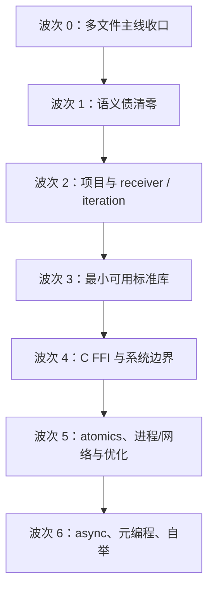

# Koven v0.32 后续语言与编译器开发路线

> 文档性质：**非规范路线建议**。本文不启用 v0.33–v0.37，不批准 Spec/ADR，也不承诺版本号。
> 每个语言变化仍须先进入用户明确启用的新 guide；架构选择走 ADR；实现走单 Goal Spec。
> 当前事实与风险见 [语言设计审计](./language-design-audit-v0.32.md)，Kotlin/Rust 差异见
> [对照清单](./kotlin-rust-design-matrix-v0.32.md)。
> 本文是 2026-08-30 冻结快照；实时依赖顺序只以
> [`docs/specs/README.md`](./specs/README.md) 为准，完整维护/归档规则见审计报告 §2.3。

## 1. 路线目标

路线以四个可验证结果排序，不按功能“炫目程度”排序：

1. **同一合法程序在单文件、项目、多文件 frontend 与 native 中具有同一语义**；
2. **资源安全不因标准库、FFI、优化或并发而出现例外通道**；
3. **每个性能能力先有可重复基线，再有优化，且 `-O0` 与 `-O2` 可观察语义一致**；
4. **未来宏、异步和自举只消费稳定阶段接口，不倒逼当前 AST/SSA 临时抽象**。

路线使用“依赖波次”而非时间承诺。每一波只有满足退出条件才进入下一波；同一波内仍按独立
Spec 顺序实施，不把多个 Goal 混入一个提交。

## 2. 第一性原理约束

### 2.1 语义不能依赖优化

- 普通 `class`、`Box`、String、容器和 escaping closure 的 owner/identity 由语言定义；
- 栈分配、allocation elision、SROA、内联、尾调用、vectorization 只能改变不可观察的实现；
- debug/release、O0/O2、单文件/项目构建必须有相同 move、drop、abort、求值顺序和输出；
- LLVM 能做某项优化不代表 frontend 可以省略语义事实。

### 2.2 所有外部资源都先成为 owner

文件描述符、Socket、进程句柄、线程、锁、channel endpoint、FFI allocation 都必须先回答：

1. 谁唯一拥有资源；
2. Borrow 和 Inout 分别允许什么；
3. close/join/release 是否可失败；
4. ASAP drop 做什么，显式 close 与 drop 如何幂等；
5. `error()` abort 不 unwind 时会发生什么；
6. 是否 `Transferable`，未来是否 `Shareable`。

未回答这些问题，不应先添加 Kotlin 风格便利 API。

### 2.3 Compiler-bound 表示，标准库承载策略

只有语言安全或 ABI 必须知道的 identity、layout、place、drop、syscall/FFI primitive 放入
compiler/runtime。命名、组合、算法、builder、格式化和业务错误类型应由 Koven `.ko` 标准库实现。
当前仍保持一个 `lang-std` Cargo member；包目录可以分层，但不要为每个模块新增 Rust crate。

## 3. 路线总览



| 波次 | 主要成果 | 明确不夹带 |
|---|---|---|
| 0 | SPEC-0199、多文件 object/link/run、统一入口 | 新语言语义、优化器、FFI |
| 1 | `Any`、Equality/Hash/Ordering、文档漂移 | Map 实现、operator 泛化 |
| 2 | project build/LSP、receiver、extension、借用式 `for` | coroutine iterator、dyn dispatch |
| 3 | collections/String/format/test、私有平台 runtime adapter、同步 IO、现行 thread/channel 最小层 | 公共 FFI、Socket/TLS/HTTP、宏系统 |
| 4 | 源语言 `unsafe`、受限公共 C ABI、opaque pointer、safe wrapper | 任意 Rust ABI、自动 String/struct bridge |
| 5 | atomic memory model、process/network、O-level、inline/vectorization/escape | 语义依赖优化、公开 IR plugin |
| 6 | Future/async、metadata/derive、分阶段自举 | Kotlin CPS 兼容、一次性重写编译器 |

## 4. 波次 0：收口 compilation-unit native 主线

### 4.1 目标

完成当前 in-progress 的 SPEC-0199，以 validated compilation-unit name/type/ownership product 为
唯一多文件 codegen 输入，生成确定性 object，并通过 project-like link/run 验收。

### 4.2 验收

- 同 package 和 import 跨文件 callable/nominal/initializer 的正反例；
- 输入 source/root 枚举置换不改变 symbol、SSA、diagnostic 和 native 输出；
- frontend diagnostic/deferred/invalid ownership 不产生或替换既有 object；
- MoveOnly 参数、return、aggregate、String、class/Box/Rc/container 的 loan/drop 逐项闭环；
- object 写入原子，失败无 sibling temporary 残留；
- workspace test、Clippy `-D warnings`、LLVM verifier 与真实 link/run 全部记录。

### 4.3 收敛动作

SPEC-0199 完成后单独建立“统一分析入口”维护任务：CLI/LSP/codegen 默认都消费 compilation-unit
产品，单文件 API 只作为薄适配和兼容测试，不再独立添加语义能力。退役必须先统计直接调用方，
不能大范围删除现有测试。

## 5. 波次 1：先解决语义债

### 5.1 `Any` 的唯一角色

建议新 guide 明确 v1 的 `Any` 是 **bound-only top**：

- 可写 `<T : Any>`，并与省略 bound 等价；
- 不能作为 field/local/parameter/return/container element 的 runtime value type；
- `if`/`when` 无关 concrete branch 不自动 join 为 `Any`；
- 需要公共值类型时要求显式 enum、interface 的未来 `dyn` 或用户自定义 wrapper。

验收必须覆盖同文件和跨文件 `when`、expected `Any`、泛型实例化、container storable 与 native
拒绝边界。如果用户选择 runtime existential，则应把它作为 v2 `dyn` 级别的独立设计，不在本波
实现。

### 5.2 Equality / Hash / Ordering

建议按三份可单独验收的契约推进：

1. **Equality**：列出哪些 concrete type 可用 `==`，nullable/enum/value/class/Box/Rc 是结构相等、
   owner identity 还是不允许；String 保持 UTF-8 bytes equality；浮点需明确 NaN 与 signed zero。
2. **Hash**：`Hashable` 必须与 equality 一致；算法 seed、DoS 防护和 map iteration order 不进入
   源语言稳定语义，除非明确要求可复现；key 查询只 Borrow。
3. **Ordering**：`Comparable<T>` 与 `==` 分离，先决定 total/partial order。浮点建议用显式
   partial comparison API，不假装满足数学全序；String 默认顺序与 locale collation 分离。

第一版可保持 compiler-bound sealed capability，随后再决定是否开放用户实现。开放前必须有
coherence、泛型 dispatch、diagnostic 和 law-testing 方案。

### 5.3 文档与实现漂移

- 本审计已把 guide 附录中不合法的 `Comparable<T>` operator 示例改为合法泛型示例；
- 单独解决 parenthesized `when` condition 的 parser/guide 漂移；
- 在 borrowed container iteration 前补齐 exit-qualified loop drop facts；
- 为 candidate guide 建“直接基于 v0.32、互不隐式包含”的状态表，避免版本号被误当成依赖链。

退出条件：frontend 不再产生无 backend 表示的 `Any` value；所有 `==` 的合法类型都有一致的
native/确定性拒绝策略；Map Spec 可以引用稳定 key contract。

## 6. 波次 2：项目可用性、receiver、extension 与迭代

### 6.1 Project build/run 与多文件 LSP

顺序建议为：

1. SPEC-0199 完成；
2. SPEC-0187 把 compilation-unit diagnostics/definition 接入 LSP；
3. 决定并启用 project build 所需 guide，不把 trailing lambda/implicit `it` 当作构建工具前置；
4. SPEC-0054 只消费 immutable source-set provider，完成 deterministic project build/run；
5. 加入 dependency/lockfile 仍需独立 guide/Spec，不从 manifest v1 自动扩张。

### 6.2 Instance receiver

receiver 是标准库可读 API、extension、operator protocol 和 IO ergonomics 的共同前置。候选 v0.34
应先证明以下不变量：

- receiver mode 明确是 Borrow/Inout/Value；无 marker 默认 Borrow；
- receiver 求值一次，优先于普通实参；
- member overload 选择包含 receiver mode/type，不允许隐式 move borrowed receiver；
- field 与 method 同名、nullable receiver、companion/static member 的优先级确定；
- callable reference/bound method value 不随普通调用顺手启用。

### 6.3 Extension function

建议首版语法贴近 Kotlin，例如 `fun String.isEmpty(): Boolean`，但语义是普通静态函数加隐藏
receiver：

- extension 不注入类型，不改变 layout/vtable，也不能访问 private internals；
- 真 member 永远优先于 extension；
- extension 只由显式/同包 import scope 参与，多个候选走普通 overload 冲突；
- receiver 默认 Borrow，未来可显式 `inout`/`own`，不能从函数名推断；
- nullable receiver 必须显式写 `T?`；
- 首轮不做 extension property、generic receiver specialization 或 implicit conversion。

验收应包含跨 package 同名 extension、member shadow、receiver move/loan、nullable 与输入置换。

### 6.4 借用式 `for`

v0.37 的 compiler-bound provider 方向适合 v1：无 iterator object、无 allocation、对容器建立整个
循环期 shared loan，每轮给出 Borrow element place。实施前必须完成 typed iteration plan、
exit-specific ownership facts、SSA provider primitive 与 native loop lowering。

首轮只覆盖 Array/List/MutableList，不扩展到 Map/String/range/IO/user iterator。消费式迭代和可逃逸
iterator value是另一套 ownership 设计。

### 6.5 Operator 与 infix

v1 继续保持封闭：builtin operator 和软词 `to` 由语言/标准库契约解释，用户不能声明自定义
`operator fun` 或 `infix fun`。receiver 与能力协议稳定后，如要开放 operator，只开放**固定拼写到
固定方法名**的映射，例如算术、comparison、`get`/`set`、`contains`；不得增加自定义符号或优先级。

以下构造始终不应重载：`&&`/`||` 的短路、`=`、Elvis、safe call、postfix `?`、`!!`、`is`/`as`、
Borrow/Inout marker。每个可重载 operator 必须规定 receiver/argument mode、左右求值一次、compound
assignment 的 read-modify-write place 和候选冲突。Equality 在波次 1 单独设计，不能因为方法名叫
`equals` 就自动获得 `==` 身份。自定义 infix 对 Pratt 优先级、可读性和 overload 诊断的收益不足，
建议 v1 始终只保留 `to`。

退出条件：用户可以构建多文件项目，LSP 使用同一 compilation unit；stdlib 可以通过 receiver 和
borrowed `for` 实现 API，而不引入第二套编译器特例。

## 7. 波次 3：最小可用标准库

### 7.1 分层而不拆 Cargo crate

建议在 `lang-std/koven/` 内形成逻辑包，具体包名由新 guide 决定：

| 层 | 最小内容 | 编译器绑定范围 |
|---|---|---|
| prelude/core | 基础 identity、`Pair`、`Result`、error、能力名称 | identity/primitive only |
| text | String 查询、builder、UTF-8 encode/decode、format protocol | String owner primitive、concat/equality/output adapter |
| collections | Array/List/MutableList API、HOF、builder；Map 后置 | header/place/index/relocation primitive |
| io/fs | `Reader`/`Writer`、ByteArray、File/FileHandle、buffer | 小型 OS/runtime adapter |
| concurrent | 现行 `thread()`/channel 表面、具体 handle；Mutex/atomics 后置 | platform thread primitive |
| process | Command/Child/ExitStatus/pipe | platform spawn/wait primitive |
| net | IpAddress、Tcp/UDP owner、DNS/timeout | platform socket primitive |
| time | monotonic/system clock、Duration | platform clock primitive |
| test | assert 与 `@Test` metadata | test discovery adapter |

### 7.2 最小完成集

“最小标准库”不等于把所有常用平台功能放进 prelude。建议 v1 可用性门槛只包含：

- `Pair`、`Result`、基础 Option 方案（可继续用 nullable 还是新增 `Option` 需决策）；
- String length/byte/scalar iteration、builder、明确 UTF-8 编解码与 interpolation formatting；
- ByteArray、Array/List/MutableList 的 size/index/add/remove/clear 与核心 HOF；
- `Reader`/`Writer`、stdin/stdout/stderr、File open/read/write/close；
- 现行 `thread()` 的启动/join，以及 `channel<T>()` 的 typed send/receive runtime；
- assert/test runner metadata。

Map、Socket、process、TLS、HTTP、regex、日期时区、serialization 都不是 core 最小集，可在同一
`lang-std` 中按依赖后续加入。

波次 3 的 IO/thread 可以消费 **backend-private、版本化且逐 target 测试的平台 runtime adapter**，
正如现有 String/allocator/output runtime 一样；它不向 Koven 源码暴露 C pointer、symbol 或
`unsafe`。波次 4 才设计公共 `extern "C"`。两层 ABI 必须分别记录，不能因内部调用 libc 就声称
用户已有 FFI，也不能让公共 FFI 反向成为所有标准库实现的必经层。

### 7.3 同步 IO 与文件

首轮采用同步阻塞模型：

- `File`/`FileHandle` 是 MoveOnly owner；Borrow read，Inout 改变 cursor/write，drop best-effort close；
- open/read/write/flush/close 返回结构化 `Result`，不以 abort 表示正常 OS failure；
- core IO 以 bytes 为准，String decode 显式验证 UTF-8；
- short read/write、EINTR、EOF、partial progress 在 adapter 层确定性处理；
- 显式 close 后 drop 不重复关闭错误 fd；close 失败如何上报必须有 API 约定。

### 7.4 Thread 与 channel

现行 guide 已确定顶层 `thread(move { ... })`、`channel<T>()`、`Sender.send` 的 Value delivery 与
cross-thread `Transferable` effect；frontend 检查已经落地，缺的是具体标准库/runtime/native
表面。实施应保持现行拼写，除非先由新 guide 明确批准破坏性改名：

- `thread` 的 task 参数继续是声明端 Value/`own` 的 `move () -> Unit`；全部 capture 必须
  `Transferable`；
- 具体 handle 类型仍需新 guide 封闭；其 drop 是 detach、abort 还是强制 join 不能由实现猜测。
  建议显式 join，drop 不阻塞；是否 lint 未 join 另行设计；
- channel send 是 Value delivery，发送后 MoveOnly 值不可使用；receive 取得新 owner；
- `Rc` 永不 `Transferable`；未来 `Arc` + atomics 与 `Shareable` 独立设计；
- thread panic 不存在；现行 task 返回 `Unit`，worker 的可恢复失败应把显式 `Result` 经 channel
  交付，join 只负责生命周期。若希望 join 返回 `Result<T,E>`，必须由新 guide 把 task/handle
  泛化为 `move () -> T`；abort 仍终止整个进程。

## 8. 波次 4：受限 C FFI 与系统边界

### 8.1 首轮范围

建议从**仅导入 C 函数**开始，随后才支持 export/callback：

```kotlin
unsafe extern "C" {
    fun close(fd: Int): Int
    fun read(fd: Int, buffer: CPointer<Byte>, length: CSize): CSSize
}
```

以上只是设计示意，不是现行语法。新 guide 必须定义：

- `unsafe extern "C"` 声明与 `unsafe {}` 调用边界；
- ABI-safe 首轮白名单：固定宽度整数、Float/Double、`Unit`、opaque pointer，以及 target-aware
  `CSize`/`CSSize`/`CLong` 等 C ABI identity；这些 identity 不是普通 Koven `ULong`/`Long` 的别名，
  由 binding/target 在每个 ABI 上验证宽度和 signedness；
- `Boolean`、`Char`、String、nullable、普通 class、value/enum、泛型、容器、closure 不可直接跨界；
- `CString`/byte span 显式转换，不把 Koven String 当 NUL-terminated `char *`；
- C 调用不允许异常/unwind 穿越边界；errno/out-param/error code 由 safe wrapper 转成 `Result`；
- symbol naming、link library、calling convention、alignment、target triple 与 header/binding 生成；
- foreign pointer 的 provenance、nullability、lifetime 义务写在 API/SAFETY contract 中。

### 8.2 C struct 与 callback 的后续步骤

第二步才加入 C enum/struct 的 `@CLayout`/等价声明或 binding generator；它们不属于首轮函数
import 白名单。不得复用 Koven 默认 value class layout 冒充 `repr(C)`。每个 target 用 C compiler
生成 `sizeof/alignof/offsetof` oracle，与 Koven ABI manifest 比对。

callback 首轮只允许 non-capturing `extern "C"` function pointer。capturing closure 需要 userdata
owner、registration lifetime、C 侧取消协议、跨线程和 unwind 规则，必须独立 Spec。

### 8.3 系统编程 profile 需求草案

波次 4 只能记录 profile 需求，不能启用最终 system profile；后者还必须等待波次 5 的 atomic
memory model。候选分层是：

- hosted：现有 allocator、Clang/linker、stdlib 与 process runtime；
- system：允许 raw/opaque pointer、atomics、platform API，但仍有 runtime；
- freestanding：无默认 allocator/entry/stdlib，属于远期独立产品，不是 hosted 的 feature switch。

hosted profile 可在公共 FFI 稳定后单独验收；system profile 只有在 target ABI、atomic ordering、
资源和平台 API 都闭合后才能启用。freestanding 继续作为远期独立产品。

退出条件：至少 macOS AArch64 + 一个不同 ABI target 的 C conformance matrix；unsafe 操作有
compile-fail；safe wrapper 不泄漏 foreign pointer；资源释放有 native sanitizer/fixture 证据。

## 9. 波次 5：Atomics、进程、网络与性能优化

### 9.1 Atomic memory model 与共享前置

如果 Koven 要宣称支持共享内存并发，必须先有独立 guide/ADR 定义原子内存模型；否则本路线的
完成口径只包含“通过 Value delivery 转移 owner”的 thread/channel，不包含共享可变状态。建议节点：

- 首轮只提供封闭的 atomic scalar/handle 类型，不把普通 `var` 自动升级成 atomic；
- 明确定义 `Relaxed`、`Acquire`、`Release`、`AcqRel`、`SeqCst` 等 ordering 及每个 operation 的
  合法组合，诊断非法 load/store ordering；
- 对每个 target 查询 width/alignment/lock-free 能力；是否允许 runtime lock fallback 必须是公开
  契约，不能由 LLVM 偶然选择；
- atomic owner 是否 `Copyable`/`Transferable`、地址稳定、drop 与 FFI layout 分别定义；
- 建立 litmus/native stress、ThreadSanitizer 可用平台测试和 LLVM ordering verifier 断言；
- `Arc<T>` 依赖原子 strong count；跨线程共享 Borrow 还依赖 future `Shareable`。两者仍是 v2
  独立语义，不能仅因 atomic primitive 存在就自动启用。

### 9.2 Process

`Command` 是可复用 builder，`Child` 是 MoveOnly process owner，stdin/stdout/stderr pipe 是独立
MoveOnly IO owner。spawn/wait/kill 返回 `Result`；argv/env 不通过 shell 拼接。是否自动 kill child、
zombie reaping、drop 行为和平台信号必须明确，不能复制某个平台偶然行为。

### 9.3 Socket

顺序建议：地址类型 → blocking TCP/UDP → DNS → timeout/nonblocking primitive → async adapter。

- Socket 是 MoveOnly owner；accept 返回新 owner；Borrow query，Inout send/receive/configure；
- bytes 是核心，String 编解码显式；
- partial send/receive、EOF、timeout、would-block、connection reset 有稳定 error kind；
- TLS/HTTP 不进入最小 std，可作为独立库；
- 不在 blocking API 中提前隐藏 executor 或 coroutine。

### 9.4 优化级别与基准先行

第一项性能 Spec 只建立基础设施：

- CLI `-O0/-O1/-O2/-O3` 与 debug/release 的独立含义；
- LLVM new pass manager 的目标 pipeline，默认仍由 LLVM 版本固定；
- 保存 pre-opt/post-opt LLVM IR、optimization remark 和可复现 command；
- benchmark corpus 覆盖标量、String、aggregate、Rc、container、closure、递归、drop-heavy CFG；
- 以当前 Koven O0 为正确性基线，以同算法的 Clang C/Rust release 作为性能参照，不设未经测量的
  百分比承诺；记录 compile time、object size、runtime、allocation count 与 peak memory；
- O0/O2 differential tests 比较 stdout/exit/ASAN-like resource evidence。

LLVM 官方的
[New Pass Manager](https://llvm.org/docs/NewPassManager.html) 和
[Loop/SLP Vectorizers](https://llvm.org/docs/Vectorizers.html)应作为实现基线；Koven 不复制成熟 pass。

### 9.5 内联

先使用 LLVM inliner，再考虑 Koven typed-SSA inliner。Koven pass 只有在 LLVM 看不到高层 owner/
effect 信息且 benchmark 证明瓶颈时加入。必须保持：

- argument 左到右求值和 Value/Borrow/Inout delivery；
- loan start/end、ASAP drop、abort edge 与 debug location；
- lambda 独立 return 边界，绝不因 inline 获得 Kotlin 非局部 return；
- recursive SCC 有预算，不能无限展开。

若开放源语言 `inline`，它最多是 hint/强请求；`noinline` 可服务调试与 ABI。是否拒绝无法内联的“强请求”
必须另行定义，不建议让性能提示改变类型检查。

### 9.6 逃逸分析与栈分配

建议在 typed SSA 上发布 allocation escape summary：

```text
NoEscape < Return < Store < CapturedByCall < ThreadOrSuspend < Unknown
```

具体枚举名不属于本路线承诺。栈提升只有全部条件成立才允许：

- allocation 大小/对齐在 target 上有界；
- owner 不 return/store/unknown-call/callback/thread/suspend/FFI expose；
- pointer identity 不可观察；
- 所有 normal exit 的 drop/free 与原 heap 语义等价，abort 仍不 cleanup；
- lifetime 不跨动态栈边界；
- debug info 能指向原变量或明确优化掉。

普通 `class` 的语言语义仍是 heap owner；这是 allocation elision，不是用户可依赖的“栈 class”。
先做 scalar replacement 和短生命周期 Box/class，再扩展到 move closure。容器 dynamic buffer 通常
不做栈提升，除非长度是小编译期常量且有独立 stack-size policy。

### 9.7 Vector 向量化

分三层推进：

1. **LLVM 自动向量化**：先有 canonical loop、O2、alias/alignment/noalias facts 和 remarks；
2. **Koven 循环合法化**：v0.37 provider lowering 生成 Loop Vectorizer 易识别的 induction/limit；
3. **显式 SIMD API**：只有 benchmark 证明自动向量化不足，再设计 `Vector<T,N>`/portable SIMD。

不要把 `Vector` 与 `Array`/List 混为一类。显式 SIMD 需要合法 lane type、固定 N、target feature、
fallback、alignment、shuffle/reduction 与 ABI 设计；在 const generic 政策前不应加入源语言 vector
type。向量化失败不是语义错误，remark 才是诊断工具。

## 10. 波次 6：async、注解/宏与自举

### 10.1 Coroutine / async 模型

现行 guide 只把 `Future<T>` state machine + `async`/`await` 列为 v3 **推荐方向**，尚未启用具体
语义。以下均是本审计的候选建议，不是 v0.32 契约；它们也不复制 Kotlin `suspend` + CPS 的
可观察 ABI：

- 建议 lowering 在 Koven typed IR/SSA 层形成显式 state machine；
- 建议 future 是 MoveOnly owner，drop 表示 cancellation，并精确析构已初始化 state fields；
- 建议首轮不允许 Borrow/Inout 活过 `await`，所有跨 suspend 值必须 owned；
- thread-pool executor 候选还应要求 capture/state `Transferable`；
- executor、timer、reactor 建议属于库/runtime，而不是语言内建全局 singleton；
- structured concurrency 建议通过 scope/task group API，而不是隐式 detached spawn；
- LLVM coroutine intrinsics 如采用，只是 backend 策略。官方文档明确其兼容性并非稳定承诺，
  不能成为 Koven public ABI：参见 [LLVM Coroutines](https://llvm.org/docs/Coroutines.html)。

### 10.2 `lazy`

区分三件事：

- lazy value：标准库 `Lazy<T>`；
- singleton lazy initialization：`object` v2 runtime；
- lazy sequence：iterator/generator/coroutine 层。

v1 不增加 `lazy` 关键字。若先做 `Lazy<T>`，采用 thread-confined MoveOnly state machine：
`Uninitialized → Initializing → Ready`，定义递归初始化、initializer abort、drop 与重复读取。线程安全
`Lazy` 等 `Arc`/Shareable/atomics 后再加入。

### 10.3 编译期注解、derive 与 macro

按风险递增分四级，不一次打包成“宏系统”：

| 级别 | 能力 | 允许修改程序 | 建议时间 |
|---|---|---|---|
| 0 | metadata annotation（`@Test`、`@Deprecated`） | 否 | 标准库/test 可用后 |
| 1 | compiler-bound derive（Equality/Hash/format） | 只生成封闭成员 | 能力协议稳定后 |
| 2 | hygienic syntax macro | 是，发生在 name/type 前 | 项目构建、增量/缓存策略稳定后 |
| 3 | typed IR plugin/aspect | 是，影响最深 | 不作为 v1 public feature |

所有生成必须确定性、hygienic、有来源 Span、受 recursion/output budget 限制。宏不得访问任意网络/
文件系统或依赖机器绝对路径。syntax macro 产生新 AST 后从 signature collection 重新进入完整
name/type/ownership；closed derive 只能读取先前完成的 header/type-shape，生成稳定声明身份后也必须
**重建完整 signature graph、重新名称解析，再检查 body/type/ownership**。任何在 type checking
之后改 AST 的 Aspect 都必须使旧 signature/name/typed/ownership facts 全部失效，不能直接“修补”
局部表。

### 10.4 HIR 是否需要

暂不新增 HIR。建立 ADR 的触发条件建议为以下至少三项同时成立：

- AST desugaring 在 name/type/ownership 三处重复；
- macro/derive 需要稳定、比 AST 更语义化的生成目标；
- LSP/incremental cache 需要 declaration/body 分离的稳定 schema；
- 两个以上 backend 或解释/const-eval consumer 需要共享 typed semantic form；
- SSA lowering 因直接消费 AST 而出现可量化的模块重复/耦合。

若触发，HIR 只表达已解析声明、显式 receiver/call target、desugared control 与 source mapping；
ownership/effect/drop 仍作为后续 facts，typed SSA 仍是 codegen canonical IR。不要同时引入 HIR、
macro 和 optimizer，无法归因回归。

### 10.5 编译器自举

当前 `prelude.ko` 被 Rust 实现的 `kovenc` 编译是**标准库 bootstrap**，不是 compiler self-host。
自举继续放在 v4+，分阶段推进：

1. Stage 0：现有 Rust `kovenc`，作为可信 bootstrap compiler；
2. 先用 Koven 实现纯 frontend 子集或独立工具，不触碰 LLVM/backend；
3. 定义稳定的 compiler service/IR serialization 边界，让 Rust/Koven 实现可并行对照；
4. Stage 1：Stage 0 编译 Koven compiler；
5. Stage 2：Stage 1 再编译相同源码；
6. 比较 diagnostics、typed facts/SSA、运行测试；在 deterministic codegen 成熟后再要求 object
   reproducibility。

Rust 编译器的 staged bootstrap 是有价值的工程参照，但不是 Koven 必须复制的实现：
[rustc bootstrap 介绍](https://rustc-dev-guide.rust-lang.org/building/bootstrapping/intro.html)。

自举前置：项目依赖/锁、跨平台 release、完整 std/IO、稳定 FFI 或 LLVM binding、性能可接受的
Koven collections/String、compiler test harness、stage artifact provenance。不要一次性重写 14 万行
Rust 编译器，也不要为自举提前扭曲 v1 语义。

## 11. 递归、高阶函数与柯里化的具体策略

### 11.1 递归

维持具名函数先收集签名的做法，允许跨文件 mutual recursion。新增以下工程保障：

- 泛型实例化按 canonical key 去重，并对无限类型变化链给出稳定诊断；
- compiler 内部 parser/type/layout/monomorphization 各自使用明确 budget，不能 stack overflow/panic；
- runtime recursion 可能耗尽栈，语言不保证无限递归；未来可提供 stack-size/thread API；
- tail-call elimination 只是优化；需要资源保证的算法应显式循环；
- recursive value/enum 只允许经 class/Box/Rc/container/function handle 打断 inline cycle。

### 11.2 高阶函数

现有 function type + lambda + monomorphization 足够作为基础。stdlib HOF 先覆盖：

- Borrow container 上先提供 `forEach`、Borrow-element `map` 与 `fold`；callback 不能从 Borrow
  element 移出 MoveOnly 值；
- 返回 owning `List<T>` 的 `filter` 若只借用源容器，首版必须要求 `T : Copyable`。MoveOnly `T`
  需要消费整个源容器的独立 `filter(own source, ...)`/consuming iteration 契约，或未来 borrow-view；
  不能从 shared element place 偷移 owner；
- callback 参数 mode 明确，不能默认把 MoveOnly accumulator 复制；
- borrowed lambda 不逃逸；存储 callback 的 API 必须要求 `move`/Value；
- 对 allocation 行为公开：`map` 构造新 owner，`forEach` 不分配，lazy sequence 另行设计；
- HOF 与手写 `for` 在 O2 benchmark 中并列，必要时依靠 inline/monomorphization，而不是特殊语义。

### 11.3 柯里化

不加入隐式 currying。`f(a)(b)` 只有在 `f(a)` 的结果本身是 function value 时才合法。未来标准库
可以为有限 arity 提供显式 `curry`、`uncurry`、`compose`、partial application helper；它们按普通
move closure 规则工作。这样不改变 call grammar、overload resolution、allocation 或错误位置。

## 12. 设计主题决策索引

| 用户关注项 | 当前结论 | 建议落点 |
|---|---|---|
| 系统级编程 | 基础已具备，尚未达到产品承诺 | 波次 4 可验收 hosted FFI；system profile 还需波次 5 atomic memory model |
| FFI/C | 无 public ABI | 受限 import → C layout → export/callback |
| Comparable / String `==` | String equality 已实现；ordering 未定义 | 波次 1 分离 Equality/Hash/Ordering |
| lambda 逃逸 | borrowed 不逃逸，move 可逃逸，跨线程查 Transferable | 保持；存储 ABI/调用次数后续补 |
| 自举 | std bootstrap 已有；compiler self-host v4+ | 波次 6 staged bootstrap |
| 逃逸分析/栈分配 | 无；不能改变 heap 语义 | 波次 5 O pipeline 后做 allocation elision |
| 扩展函数 | 无 | receiver 稳定后静态 extension |
| value/data class | value/class 为硬关键字；data class 未定义 | 保持正交，data 用条件 derive 方向 |
| List/Map | 顺序容器 primitive + std API；Map 候选 | Equality/Hash 后做 Map |
| Vector | 无显式 SIMD；LLVM 可自动向量化 | canonical loop/O2/remarks 后再评估 Vector type |
| 递归 | 函数支持；inline type cycle 拒绝 | 补实例化 budget 和 runtime 文档 |
| HOF/柯里化 | HOF 基础有；无自动 currying | std HOF + 显式 compose/curry helper |
| 内联 | LLVM O0，无源语义 | LLVM inliner 先，Koven pass 后，inline 仅 hint |
| 进程 | 无 | IO/FFI 后 MoveOnly Child/pipe |
| 并发/线程 | 现行 `thread()`/`channel()` 与 Transferable/effect 已定义，runtime API 无 | 保持现行拼写并封闭具体 handle/runtime |
| 协程/异步 | v3 只有推荐方向 | 候选 Future state machine；建议首轮无 borrow 跨 await |
| IO/文件 | 仅 println stdout | 同步 byte IO + Result + File owner |
| Socket | 无 | blocking TCP/UDP 后 async adapter |
| operator/infix | builtin/to 封闭，用户自定义无 | receiver 后固定协议；不开放优先级 |
| lazy | 无 | thread-confined `Lazy<T>` 库先行，非关键字 |
| 注解/macro/aspect | 无 | metadata → derive → hygienic macro；无 v1 public IR aspect |
| 单层 abstract class | 无继承 | v1 继续拒绝，interface + delegation |
| 最小标准库 | prelude/Pair/Result/String/Rc 等已有窄面 | text/collections/io/thread/test 分层完成 |
| HIR/Typed IR | AST + facts → typed SSA | 有至少三个真实消费者再引入 HIR |

## 13. 每波统一验收模板

每个新 Goal 至少回答并验证：

1. **语义**：现行 guide 的正例、反例、求值顺序、错误/abort/drop 行为；
2. **类型**：identity、泛型替换、能力、nullable、storable/layout kind；
3. **所有权**：Copy/Move/Borrow/Inout、loan 范围、capture、所有 CFG exit 的 drop；
4. **IR**：typed operation、effect、verifier 正反例、稳定 render/snapshot；
5. **LLVM/native**：target DataLayout、LLVM verifier、object/link/run、至少一个失败不落盘用例；
6. **工具**：machine diagnostics、LSP/formatter/grammar 是否受影响；
7. **确定性**：输入置换、重复运行、debug/release/O0/O2；
8. **资源**：allocation/free/retain/release/close/join 次数和 abort 边界；
9. **安全**：非法用户输入不 panic，FFI/unsafe 有 compile-fail 和 target ABI oracle；
10. **文档**：Architecture 只更新已实现事实，Spec 记录真实命令，未跑项明确标出。

这一模板是后续路线的共同完成定义；任何“演示能跑”但缺少类型/所有权/verifier/失败路径的实现
都不能视为闭环。
