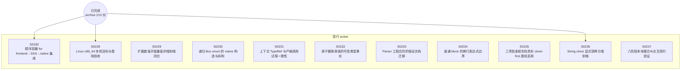

# Spec 依赖图

> **性质**：生成物（勿手改） · **状态**：current · **读取时机**：追溯 Spec 依赖拓扑时 · **唯一真源**：各 Spec 正文

由 `scripts/gen_spec_dag.py` 生成；只画拓扑结构，不含验收状态；状态见[README](README.md)。
重建时机：guide 版本启用或新增/迁移 draft Spec。
SVG 版本：[dependency-graph.svg](dependency-graph.svg)。

## 节点链接

| 节点 | 分区 | 文档 |
|---|---|---|
| SPEC-0182 | active | [0182-sequential-for-lowering.md](active/0182-sequential-for-lowering.md) |
| SPEC-0228 | active | [0228-linux-x86-64-native-host.md](active/0228-linux-x86-64-native-host.md) |
| SPEC-0229 | active | [0229-extended-numeric-literal-values.md](active/0229-extended-numeric-literal-values.md) |
| SPEC-0230 | active | [0230-recursive-boxed-enum-native.md](active/0230-recursive-boxed-enum-native.md) |
| SPEC-0231 | active | [0231-contextual-type-ref-trials.md](active/0231-contextual-type-ref-trials.md) |
| SPEC-0232 | active | [0232-ownership-primitive-type-facts.md](active/0232-ownership-primitive-type-facts.md) |
| SPEC-0233 | active | [0233-parser-compiler-contracts.md](active/0233-parser-compiler-contracts.md) |
| SPEC-0234 | active | [0234-block-newline-continuation.md](active/0234-block-newline-continuation.md) |
| SPEC-0235 | active | [0235-approved-language-rules.md](active/0235-approved-language-rules.md) |
| SPEC-0236 | active | [0236-explicit-string-clone.md](active/0236-explicit-string-clone.md) |
| SPEC-0237 | active | [0237-local-integration.md](active/0237-local-integration.md) |
| 已完成 Spec（213 份） | archive | [archive/specs/README.md](../archive/specs/README.md) |
