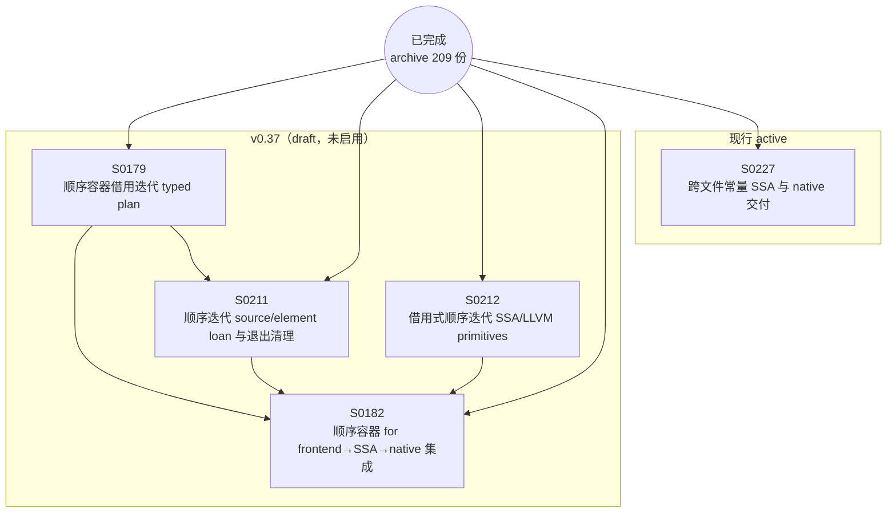

# Spec 依赖图

> **性质**：生成物（勿手改） · **状态**：current · **读取时机**：查看 Spec 依赖拓扑时 · **唯一真源**：各 Spec 正文

由 `scripts/gen_spec_dag.py` 生成；只画拓扑结构，不含验收状态；状态见 [README](README.md)。
重建时机：guide 版本启用或新增/迁移 draft Spec。SVG 版本：[dependency-graph.svg](dependency-graph.svg)。

## 节点链接

| 节点 | 分区 | 文档 |
|---|---|---|
| SPEC-0227 | active | [active/0227-unit-constant-native-lowering.md](active/0227-unit-constant-native-lowering.md) |
| SPEC-0179 | drafts/v0.37 | [drafts/v0.37/0179-sequential-iteration-typed-plan.md](drafts/v0.37/0179-sequential-iteration-typed-plan.md) |
| SPEC-0182 | drafts/v0.37 | [drafts/v0.37/0182-sequential-for-lowering.md](drafts/v0.37/0182-sequential-for-lowering.md) |
| SPEC-0211 | drafts/v0.37 | [drafts/v0.37/0211-sequential-iteration-ownership.md](drafts/v0.37/0211-sequential-iteration-ownership.md) |
| SPEC-0212 | drafts/v0.37 | [drafts/v0.37/0212-borrowed-sequential-iteration-ssa.md](drafts/v0.37/0212-borrowed-sequential-iteration-ssa.md) |
| 已完成 Spec（209 份） | archive | [archive/specs/README.md](../archive/specs/README.md) |
