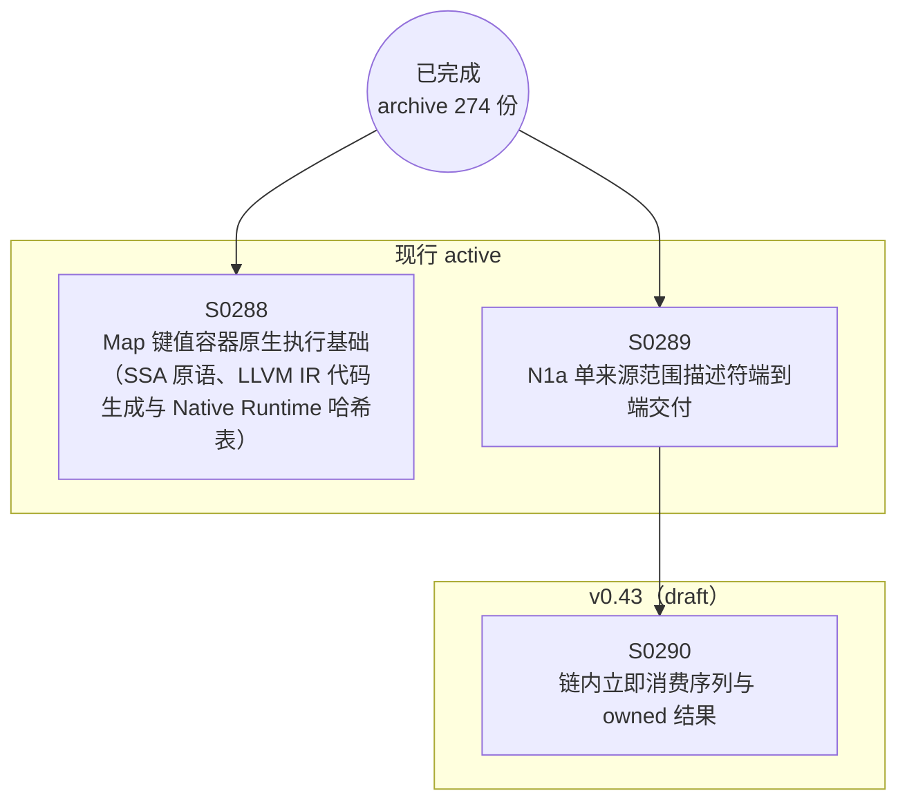

# Spec 依赖图

> **性质**：生成物（勿手改） · **状态**：current · **读取时机**：追溯 Spec 依赖拓扑时 · **唯一真源**：各 Spec 正文

由 `scripts/gen_spec_dag.py` 生成；只画拓扑结构，不含验收状态；状态见[README](README.md)。
重建时机：guide 版本启用或新增/迁移 draft Spec。
SVG 版本：[dependency-graph.svg](dependency-graph.svg)。

## 节点链接

| 节点 | 分区 | 文档 |
|---|---|---|
| SPEC-0288 | active | [0288-map-native-execution.md](active/0288-map-native-execution.md) |
| SPEC-0289 | active | [0289-n1a-range-carrier.md](active/0289-n1a-range-carrier.md) |
| SPEC-0290 | drafts/v0.43 | [0290-immediate-consuming-sequence.md](drafts/v0.43/0290-immediate-consuming-sequence.md) |
| 已完成 Spec（274 份） | archive | [archive/specs/README.md](../archive/specs/README.md) |
